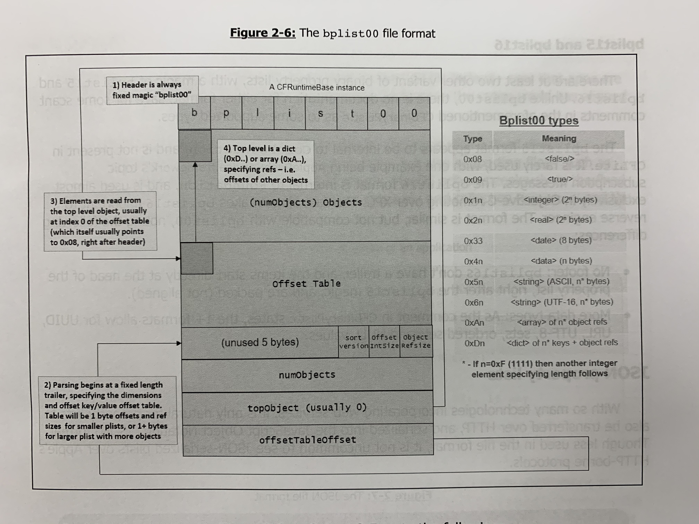

All info from *OS: Internals::User Mode*

1. Application Layer
	- Aqua - windows maanger
	- Cocoa - API's for AppKit, and  lower layers' _Foundation_ and _Core Data_
2. Mdeia Frameworks
	- Graphics and Audio frameworks (_AVFoundation_,_Core{Audio,Image,Animation}_)
	- Underlying support of OpenAL, OpenGL, and Quartz
3. Core Services
	- _Foundation_ framework (_NS*_ APIs) and it's successor _CoreFoundation_ (_CF*_ APIs)
4. Core OS
	- Basic OS APIs like _OpenDirectory_ and _SystemConfiguration_
5. Kernel and Device Drivers
	- XNU

## Bplists
- Legacy of NeXTSTEP
	- Though now serialized
- Apple discourages manual editing of property list files, explicitly warning that "the tags may change in future releases"
- Can use `$PlistBuddy`, `$plutil`, or Plist Editor Pro (GUI)
- **Binary Propert lists** - for storage efficiency on "smaller devices" (e.g. iwatch or appleTV)

Ex: `plutil -convert xml1 /System/Library/LaunchDaemons/ssh.plist -o -`
- Should have `-o -` as a safe practice.

### Bplist Internals
- Magic: bplist00 (YnBsaX)
- Offset table at 0xce

- Other formats are bplist15 and bplist16 however no documentation
	- bplist15 seems to be for CoreFoundation but is rarely used. E.g. _ApplePushService.framework_
	- bplist16 is used in Foundation specificially for XPC apps. Admitedly similar to bplist00.

## JSON Propert Lists
- Since web services used
- `$plutil` has `-convert json` ability

## SimPLISTic format
- Can use [jlutil](http://newosxbook.com/tools/jlutil.html)
- The book's own tool

(Left off page 33)
