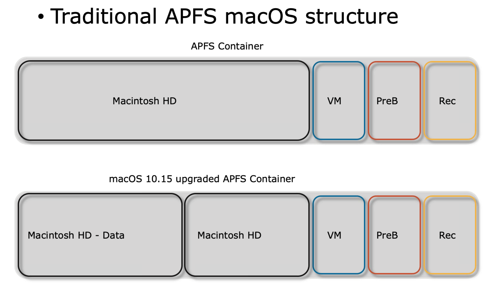
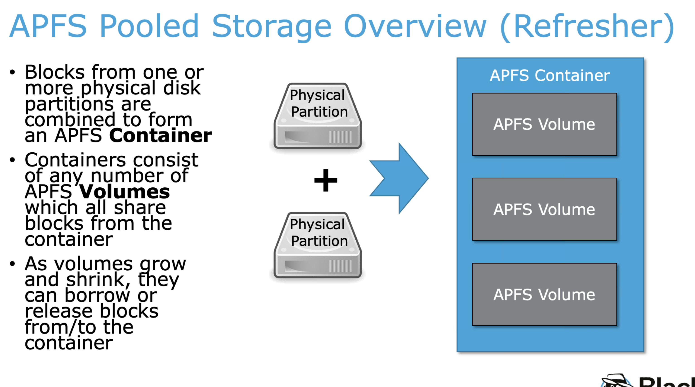
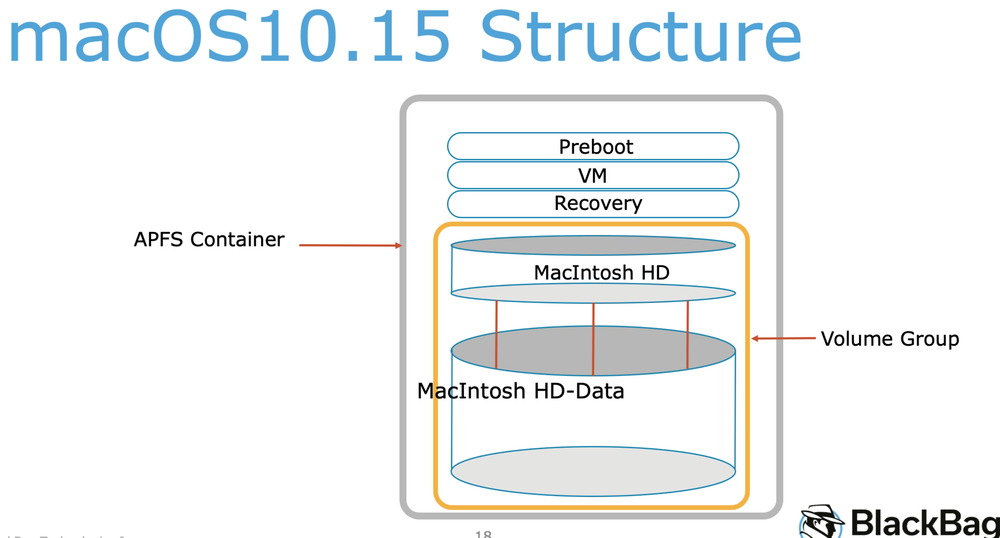
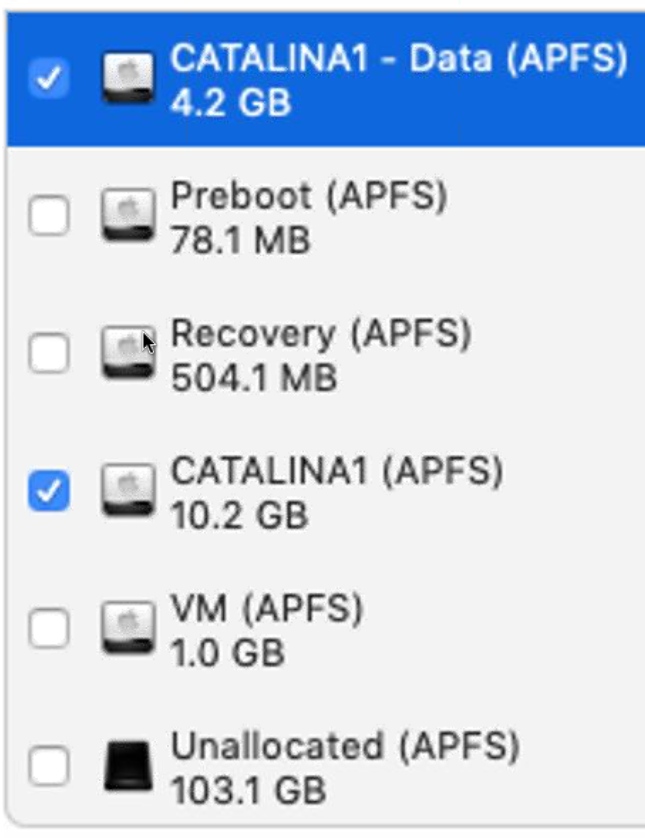
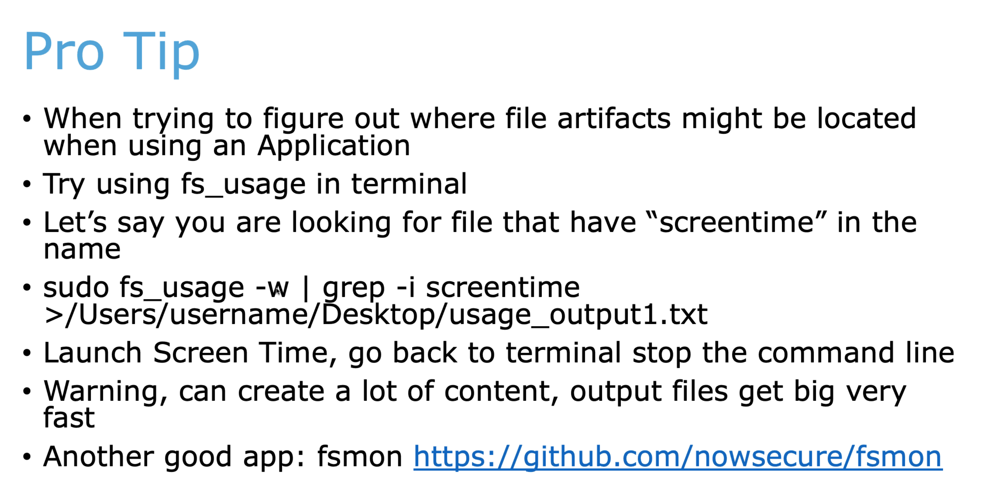

# Catalina: A Voyage Through Apple's New Artifacts 4/9/20

Derrick Donnelly, Chief Scientist at BlackBag

	- Head of IT Security Apple Computer years ago
	- CTO/Founder of BlackBag

- [Tool/Github Link]()
- [Other/Important Note](#)
- [FS_Usage utility](#Tips---FS_Usage)
- [Interesting Paths](#Important Paths)

## Summary

1. macOS Structures
2. New APFS Features
4. New apps, artifacts, and locations (plus some iOS Changes to go along with Catalina)

## Background (My own research)

- Catalina is the first version of macOS to support only 64-bit applications and the first to include [Activation Lock (prevent anyone else from using your Mac if it's ever lost or stolen.)](https://support.apple.com/en-us/HT208987)

- To find [other changes](https://en.wikipedia.org/wiki/MacOS_Catalina)

- Macquisition exports data collection at `L01`

## 1. macOS Structures

- "User's are quick to update."

#### macOS Catalina (10.15.X)

- Dropped all support for 32-bit apps
- Stricter Code Signing Required
- To load new KEXTs, a reload is necessary
- Seperated `System` and `Data` Volumes

#### Structure

Now two volumes: 

1. System 
   1. hidden `Macintosh HD`
   2. Read-only 
2. Data
   1. `Macintosh HD-Data` or `McIntoshHD - Data`
   2. Read/write

## 2. New APFS Features

- Replaced HFS
- "Containers" and Pooled Storage
  - Different from HFS where each partition had a different set of blocks.

| System Volume                           | Data Volume                                                  |
| --------------------------------------- | ------------------------------------------------------------ |
| hidden                                  | "User volume"                                                |
| mounted read-only                       | Mounted read/write                                           |
| Contains base system plist and db files | Mounts at `/System/Volumes/Macintosh HD`                     |
| "Firmware specific area"                | Has a shadow of system volume which contain system files that are writable!! |
| System/pre-installed Apple Apps         | Has Home picture in icon                                     |
| Has Finder picture in icon              |                                                              |

### Volume Groups

- Ties System and Data partitions together
- New UUID
- "[Keybags](https://support.apple.com/guide/security/keybags-overview-in-ios-and-ipados-sec6483d5760/web)" are synced among volumes

- **APFS Volume Roles** => "Metadata tags" -- Volumes for specific purposes (e.g. "(System)" and "(Data)")

- **APFS Volume Groups**
  - Volumes can be group together but must be in same container
  - Users won't notice a difference however under Finder's Applications view they are taken from seperate volumes.

#### 

### Firmlinks

- Allow mapping a directory on the System partition of a Volume group to the Data partition of the group
- Implemented as extended attributes
- Similar to symlinks - but in user's terminal you wouldn't know they're links
- **APFS FirmLinks** - on directories only

Now 5 Volumes - (System, data, preboot, recovery, vm, [unallocated section])

- All of this was found out by dd'ing a Catalina image and then uploading it on another Mac Mojave-booted system. Doing so created two Directories (Data and System), and so this was their starting point.

## 3. New apps, artifacts, and locations (plus iOS)

- Default terminal shell change to .zsh
- New tv, music, podcast get separate apps from old iTunes
- More restrictions on full disk access
- Access by third party apps to save/read files in ceertain locations
- Updates to photos app

  

**Relocated Items** => *good source of evidence* -- if apps don't work anymore, or 32-bit app we can find it here

**iOS Backups** => aren't access in iTunes, not in Finder

- Backups are in `~/Library/Application Support/MobileSync`

**macOS 10.15 Dock** => Keeps track of last 3 applications launched (not persistent)

**TimeCapsule backup** => now a `.backupbundle` file are only compatible with 10.15

**No more 32-bit apps**

**SideCar (iPad as 2nd Display)** - iPad is new place for evidence

- Look for `.ktx` files on iPad to show activity from Laptop -- they're screenshots from running apps and their active windows!

**Even the pencil** => new input device to "draw on mac" (via iPad). 

**iPad apps that can run on Mac** - more artifacts- in library folder; plists, tmp files, cache files, media files, metadata.

**Unified Logs** => New entries: Process: OS Event/ Security Logs

**Reminders** => can be location-based -- and can see where they were created

**"Find My" app** => Find, **remotely wipe**, and lock your laptop

### More security

- Permissions (ex: Apps have to ask to record your screen or typing, just like webcam and microphone)
- Protections on core operating system with System Integrity Protection (SIP) and Gatekeeper. Prevents 3rd party from writing to core files

### New Items in Privacy

"Transparency, Consent, and Control (TCC)"

- Look for data/apps that have been granted access

- see pic

### KEXTs are going away

- Considered a security risk
- Many keyloggers were KEXTs since they were hard to find
  - Some were installed as a modifying-kext
- Replaced as a "System Extension" which will live in user-land
- Good for security but terrible for functionality

### Screentime 

- "Gold mine of information"
- On by default 
- Look for app start and duration times in Apollo Plugins for App Usage from KnowledgeC
- Path: ~/Library/.../com.apple....
- `RMAdminStore-Local.sqlite`
- see pics for path

### Notes

- shared folders
- view-only collaboration 
- Secure Notes -- [not so secure](https://www.blackbagtech.com/blog/apples-not-quite-secure-notes/)

### Apple Watch

- difficult to get data from watch
- watch can unlock/lock apps

**"Message in iCloud"** - if enabled, less data stored on apple's servers

- iMessages stored as a `.csv` via Apple Search Warrant Returns as well as `Metadata.txt`
  - With warrants, attachments would be included

### Apollo

- apple patter of life lazy output'er
- Tool by Sarah Edwards
- collects and correlates ddatabases with open source
- [github for apollo](github.com/mac4n6/APOLLO)
  - [Presentation of apollo slides](....)

### Tips - FS_Usage

- `$Fs_usage` in terminal
- will create a lot of content

  

## Important Paths

- Mainly gonna look for .sqlite.db file

| App                 | Path                                                         |
| ------------------- | ------------------------------------------------------------ |
| TCC                 | `/Library/Application Support/com.apple.TCC/TCC.db (SQLite)` `Users/username/Library/Application Support/com_apple. TCC/TCC.db` (another SQLite Database) |
| Screen Time         | `/Library/Containers/com.apple.ScreenTimeAgent/Data/Library/Preferences/com.apple.ScreenTimeAgent.plist` `Users/username/Library/Application\Support/Knowledge/knowledgeC.db`  `/private/var/folders/lj/2dszxg511f964cOn8khmsgn40000gn/0/com.apple.ScreenTimeAgent/Store/RMAdminStore-Local.sqlite` `$sudo find /private/var/folders/ -name com.apple.ScreenTimeAgent` `./1j/20Sszxg511f964cOn8knmsgn40000gn/0/com.appie.ScreenTimeAgent/Store/RMAdminStore-Cloud.sqlite-wal` `./1j/20szxg511f964cOn8khnmsgn40000gn/0/com.appie.ScreenTimeAgent/Store/RMAdminStore-Cloud.sqlite-shm` `./1j/20szxg511f964cOn8khnmsgn40000gn/0/com.appie.ScreenTimeAgent/Store/RMAdminStore-Cloud.sqlite` |
| "Find My" App       | `~/Library/Preferences/com.apple.findmy. plist` `/Library/Preferences/ByHost/com.apple.findmy.XXXXXXXXXXXXXXXXXXXXXX.plist` (22 X's) `System/Library/Preferences/Logging/Processes/com.apple.findmy.plist` `/Users/username/Library/Preferences/com.apple.finadmy plist` |
| Photos App          | `~/Pictures/Photo Library/database/Photos.sqlite`            |
| Safari              | `/Users/username/Library/Safari/Databases/Databases.db` `/Users/username/Library/Safari/History.db` |
| Safari Caches       | `/Users/username/Library/Caches/com.apple.safari`            |
| Safari Bookmarks    | `/Users/username/Library/Safari/Bookmarks.plist`             |
| Safari Top Sites    | `/Users/username/Library/Safari/TopSites.plist`              |
| Safari Last Session | `/Users/username/Library/Safari/LastSession.plist` `/Users/username/Lidrary/Safari/RecentlyClosedlTabs.plist`  `/Users/username/Library/Safari/CloudTabs.db` |
| Calendars           | `/Users/XXXX/Library/Calendars/Calendar Cache`               |
| Reminders           | `/Users/XXXX/Library/Reminders/Container_v1/Stores/D ata-CE4C0/E4-D4FA-42FB-9C48-9F/4/755E6688.sqlite` `/Users/username/Library/Reminders/Container_v1/Stores/Data-local.sqlite` `/Users/zebo/Library/Reminders/Container_v1/Stores/Data-CE4C0/E4-D4FA-42FB-9C469F/4755E668e.sqlite` `/System/Library/Prererences/Logging/Processes/com.appble.reminders.plist` `/Users/zepo/Library/Containers/com.apple.reminders/Data/Library/Preferences/com.apple.reminders.plist`  `/Users/zepo/Liprary/Containers/com.apple.reminaers/Data/Library/Saved Application State/com.apple.reminders.savedState` `/Users/zepo/Library/Containers/com.apple.reminders/Data/Library/Cacnes/com.apple.reminders`  `/System/Volumes/Data/Users/zebo/Library/Reminders/DataAccess/AccountInformation. plist` |
| Notes               | `/Users/user/Library/Containers/com.apple.Notes/Container.plist` `/Users/user/Library/Containers/com.apple.Notes/Data` `/Users/user/Library/Group Containers/group.com.apple.notes/Library/Prererences/ByHost`  `/Users/user/Library/Group Containers/group.com.apple.notes/NoteStore` `/Users/user/Library/Group Containers/group.com.apple.notes/NoteStore.sqlite` `/Users/user/Library/Containers/com.apple.Notes/Data/Library/Notes/NotesV /.storedata-shm` `/Users/user/Library/Containers/com.apple.Notes/Data/Library/Saved Application State/com.apple.Notes.savedState` |
| Recent Apps Used    | `/Users/username/Library/Saved Application State`            |