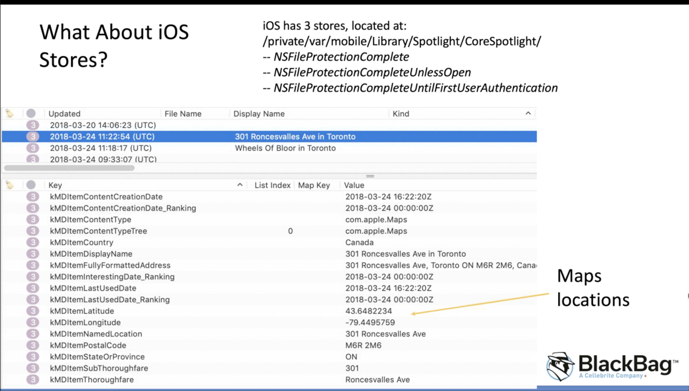
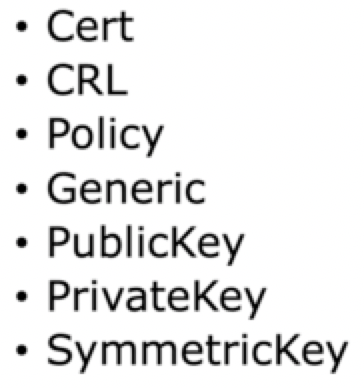
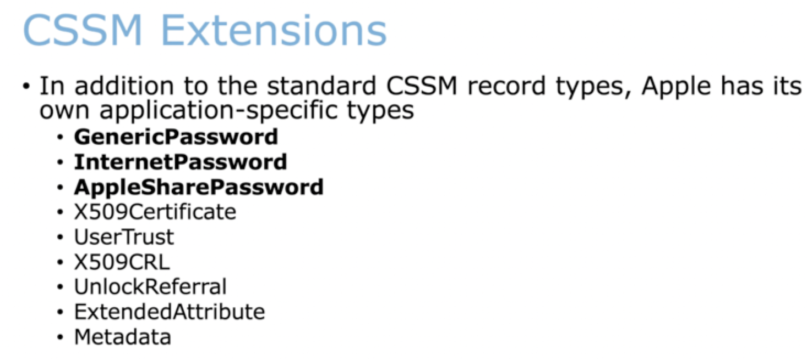
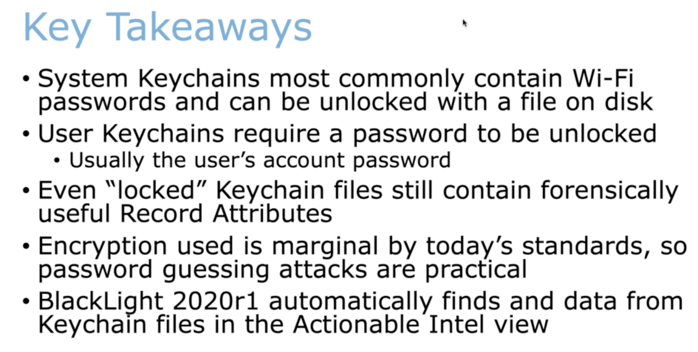

# BlackBag Presents: Spotlight and Keychain with Macquisition

- Can find in metadata:
	- Airdrop status
- In folders
	- kMDItemUserCount - don't rely on this exactly b/c 
	- 
- .app folders
	- LRU count, date (and previous dates) [apparently time isn't exact with macquisition]
	- 

- User-Level Stores

- iOS Stores

## Spotlight

- can find text files, sometimes (according to speaker) that aren't there any more
- can also track spotlight search AS LONG AS YOU CLICK/HIT-ENTER on a result. So won't keep searches that doesn't find what they were looking for.
- can be found at: /Volumes/*/.Spotlight-V100
  - Time machine backups (not covered on MacQuisition)
- remember its on macOS and iOS
- more than just files; metadata (LRU, GPS, .app residue, 3-rd party apps have 3rd party metadata, etc) and delete files
- Store files are compressed with multiple compression algorithms, but not encrypted
- Files are ONLY encrypted if FDE is on. But even if FDE, if computer is live then collection will be unencrypted

## Keychain - with Joe Sylve

- Password management system

  - includes passwords, session keys, private keys, certificates

  

  - If one user auth's a wifi, then all users do too
  - parsing system keychain will unlock everything else

- built of common security services manager (CSSM) going back many versions. However deprecated in OSX10.7, most structures are still the same.

  - CSSM reference: <https://pubs.opengroup.org/onlinepubs/9629299/1_chap02.htm>

  - Record types:

    - 
    - 
      - Internet and Generic are best places to look
    - Information found in them aka **Attributes**:
      - Record names (Connonical)
      - Service names
      - Account names
      - Email addresses
      - Service Names
      - MAC times (unencrypted!)

  - Security 3DES-CBC with 192 bit key -- NIST deprecated this.

    - Each database has a Data Encryption Key, Data Signing Key, and a Master Key that encrypts the KeyBlob (DEK, DSK, Metadata)

    - User keys aren't stored on Disk, they are derived by User accont password

      - Note: If user changes password the derived key might not be the same. Uses PBKDF2-SHA1 w/ 1000 iterations do derive key. 

        - NIST recommends 10,000 iterations but they don't care. 

        - Per speaker, dictionary attack would work within hours

          

### Key Takeaways 

- 
  - System keychain does not need a password, just on disk
  - MacOS only, not iOS.
  - Keychain files on Disk; can also be backed-up, copied, and moved (.keychain or .keychain-db)

# Disk Acquisition tools

- Cellebrite and rakeie

- <https://en.wikipedia.org/wiki/List_of_digital_forensics_tools>
