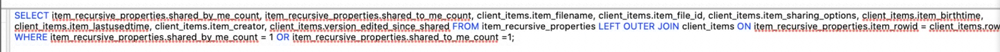

# BlackBag: iCloud File Sharing 4/30/20

Bruce Hunter

- [BlackBag's BlackLight Tool](https://www.blackbagtech.com/products/blacklight/)
- [Check Out Later](#Check-Out-Later)

## Introduction

- iCloud replaced MobileMe
- Accessible to iCloud connected devices or through web interface

## iCloud Locations on Mac

How to know if they're using iCloud? Look for the plist file at `~/Library/Preferences/MobileMeaAccounts.plist` (can even see `LoggedIn` and `Services` keys)

- macOS saves files (metadata) locally even if it's on iCloud
  - `~/Library/MobileDocuments` all files that are in iCloud
  - `~/Library/MobileDocuments/*.icloud` means only found in cloud (plist)!

### Direct iCloud Sharing

- As of macOS 10.15.4 (and iOS 13.4) uses links to download shared media from one person to another; can be messages, mail, AirDrop, and Notes.
  - File name is at end of link, after the `#`
- Can share with certain people by permission (CRUD)

#### Mobile Documents

- Location: `~/Library/Application Support/CloudDocs/session/db/client.db`

- Filenames on iCloud drive
- Tables: *Client_items* and *item_recursive_properties*
- Note: "Birth date" is created date (in MACB)
  - B dates of files that are uploaded to iCloud are respected. So when the file was created, not the day it was sent to iCloud. Same with MAC(B).
- `version_edited+since_shared` where 1=yes or 'blank'="item was read-only" or 0=no
- `shared_to_me_count` item is super important to know whether this file was shared or shared-by-me

- `item_sharing_options`:
  - 12 can make changes with link
  - 64 people invited can make change
  - 68 Only shared can make changes
  - 100 With invite, read only

## How to figure out who shared It?

- Unified logs
  - But they expire/roll
  - More and more info is being marked as private and won't be in logs
- Databases
- Apple System Logs (ASL) - might find connection info to link
- Search by Filename - maybe find it in an email or message

