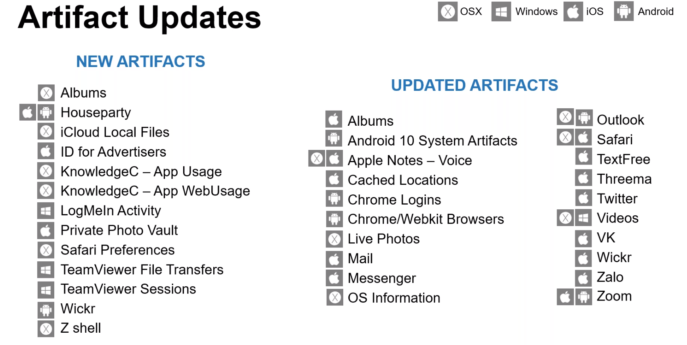

## Take a byte! Exploring Apple's MacOS Operating System Artifacts

Trey Amick @amick_tryz trey.amick@magnetforensics.com

- [KnowledgeC Database](#KnowledgeC-Database)

- [Check Out Later](#Check-Out-Later)

### APFS (The Apple File System)

- replaced HFS+ (been around since 1998)
- "Previewed" in Sierra (10.12), integrated in High Sierra (10.13) and iOS 10.3

#### When Imaging

using `$diskutil list`

- phy @ /dev/disk0

- logical apfs @ /dev/disk1 (for Catalina [10.15])

  - Macintosh HD
  - Macintosh HD - Data
  - Volume Preboot
  - Volume Recovery
  - VM

- System Integrity Protection SIP

  - restricts root user actions on /System, /usr,/bin,/sbin
  - Prevents user from creating an image of physical disk or APFS Container
  - To disable sip **`csrutil disable`**

- T2 Encryption (TPM)

  - [See info from last talk](TamingtheT2Chip.md)

- Default configuration is Full Security of Secure Boot

- Remember since Catalina came out:

  - Screen Time - grteat usage stats
  - Farewell to iTunes
  - No 32-bit apps
  - Sidecar
  - New read-only system volume (similar to Win10 "Reserve Storage")
    - `-data folder` for User Profile

- Gatekeepr improvements

- Activation Lock - Users can reactivate or erase data from missing devices

- Find My - locate lost Macs not connected to internet using Bluetooth nearby Apply devices

- Safari Artifacts

  - Bookmarks, Preferences, etc.
  - The absence of change is also important. The default options for safari are
    - Homepage - appple.com
    - Search engine - Google
    - History - Kept for 1 year
    - Downloads - `~/Downloads` AND `~/Library/Safari/Downloads.plist`
    - Keep Downloads - 1 Day
    - Auto Open "Safe" Files - Yes.
  - Preferences stored in: `~/Library/Containers/com.apple.safari/Data/Library/Preferences/com.apple.Safari.plist`
  - Downloads stored in: `~/Library/Safari/Downloads.plist`
  - xattr: `kMDWhereFroms`

  

### List of artifacts:

#### KnowledgeC Database

- Mac actually has 2, system and user level
- iOS only has one though
- [Read more at mac4n6.com](https://www.mac4n6.com/blog/2018/8/5/knowledge-is-power-using-the-knowledgecdb-database-on-macos-and-ios-to-determine-precise-user-and-application-usage)
  - Approx 4 weeks before logs roll
- Application Focus/Activities AND `INStartCallIntent:InCallService`
- Device PlugIn State
- Safari History is included here too
- "File System Events is equivalent to USNJournal on Windows"

### USB Forensics

- Start looking in Volume Information for *Evidence* of external drives plugged in.
- Note: `00x5ac` is Apple's Vendor ID; indicates

- Recommended to use [the-sz db](https://www.the-sz.com/products/usbid/) for checking *Vendor ID*, *Product IDs*, or usb *Names*.

### Airdrop Forensics

- =ad-hoc network (Wi-Fi and Bluetooth)
- If Application name is *sharingd*, this is usually referring to AirDrop

- Can be found in Unified Logs and `com.apple.quarantine`
- Relevant information being looked for would be "Incoming Transfers" and its destination folder
- `kMDItemWhereFroms`

### Deleted Images from iMessages

- iChat is predecessor of iMessage.

## Check Out Later

- [KnowledgeC Database](https://www.mac4n6.com/blog/2018/8/5/knowledge-is-power-using-the-knowledgecdb-database-on-macos-and-ios-to-determine-precise-user-and-application-usage)
- [Content Based Image Retrieval](https://medium.com/sicara/keras-tutorial-content-based-image-retrieval-convolutional-denoising-autoencoder-dc91450cc511)
- What exactly is Web-Kit? -Used by Safari, Chrome, [and Nintendo Switch](https://www.youtube.com/watch?v=8UqHCrGdxOM) is the rendering engine to draw the CSS/js. Super helpful link: https://memeburn.com/2013/02/what-the-hell-is-webkit-anyway-an-all-purpose-guide/

