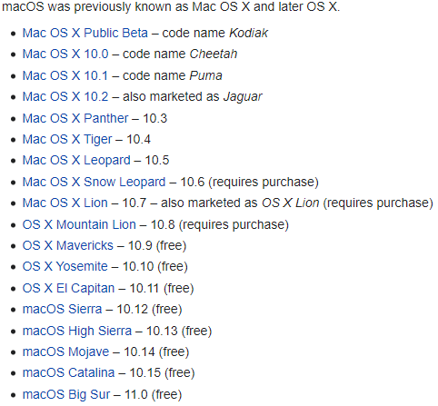

# Apple Mac Notes

[My Mac Was Hacked](mymacwashacked.md)

## Thing to Look into Next

- [ ] Take another look at [GRR](https://github.com/google/grr) with [osquery](https://github.com/osquery/osquery) for analysis
- [ ] At the moment, I cannot find any forensic ACQUISITION tools which work on Mojave, or Catalina ([my notes on acquisition tools](Acquisition_Tools.md)).

## Mac Internals

- [Art of Memory Forensics Notes](AoMF_Mac.md)
- [Jonathan Levin's Mac Internals Book](MacInternals.md)
- [Clipboard Hacking Notes](Clipboard.md)
- [BlackBag Spotlight and Keychain Deep Dive 3/26/20](BlackBag_SpotlightAndKeychain.md)
- [BlackBag New Catalina Artifacts 4/9/20](BlackBag_CatalinaArtifacts.md)
- [BlackBag iCloud File Sharing 4/30/20](BlackBag_iCloudFSsharing.md)

## Tools

- [Acquisition Tool List](Acquisition_Tools.md)
- [Tool List](ActiveDev.md)

## Talks

- [Patrick Wardle - Fire and Ice Making and Breaking macOS Firewalls](https://www.youtube.com/watch?v=UlT5KFTMn2k)
- [DEF CON 25 - Patrick Wardle - Offensive Malware Analysis: Dissecting OSX FruitFly](https://www.youtube.com/watch?v=q7VZtCUphgg&t=1s)
- [Patrick Wardle - Harnessing Weapons of Mac Destruction - DEF CON 27 Conference](https://www.youtube.com/watch?v=InL3YA_6P6s)
- [301 Black Box Mac OSX Forensics Brian Martin - start at ~27m](https://www.youtube.com/watch?v=AG72W_LVidI)

## Links

* [Determine Precise User and Application Usage](https://www.mac4n6.com/blog/2018/8/5/knowledge-is-power-using-the-knowledgecdb-database-on-macos-and-ios-to-determine-precise-user-and-application-usage)
* [SpecterOps: Hunting for Bad Apples via Launch Daemon](https://posts.specterops.io/hunting-for-bad-apples-part-1-22ef2b44c0aa)
* [Mac and Mac-Apt Basics](https://medium.com/dfir-dudes/mac-forensics-no-one-said-it-would-be-easy-8bf2f5e4956c)
* [White Paper **2018**:Testing Memory Forensics Tools for the Macintosh
  OS X Operating System](https://commons.erau.edu/cgi/viewcontent.cgi?article=1491&context=jdfsl)
* www.dfir.training (great forum too)

## Mac OS X vs OS X vs macOS Difference

- Mac OS was 2001 - 2011 

- OS X was 2012 - 2015
- macOS is 2016 - present
