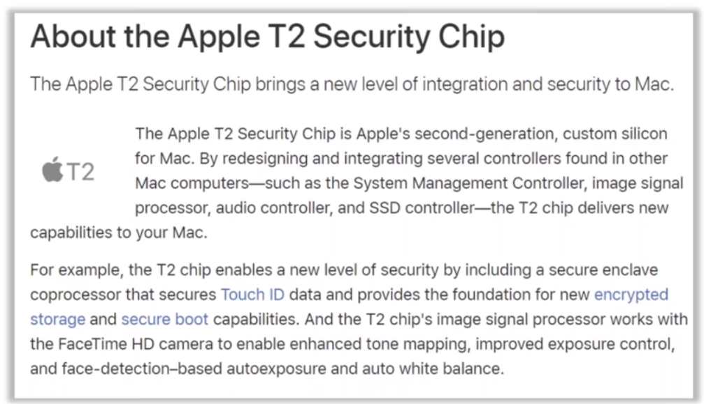
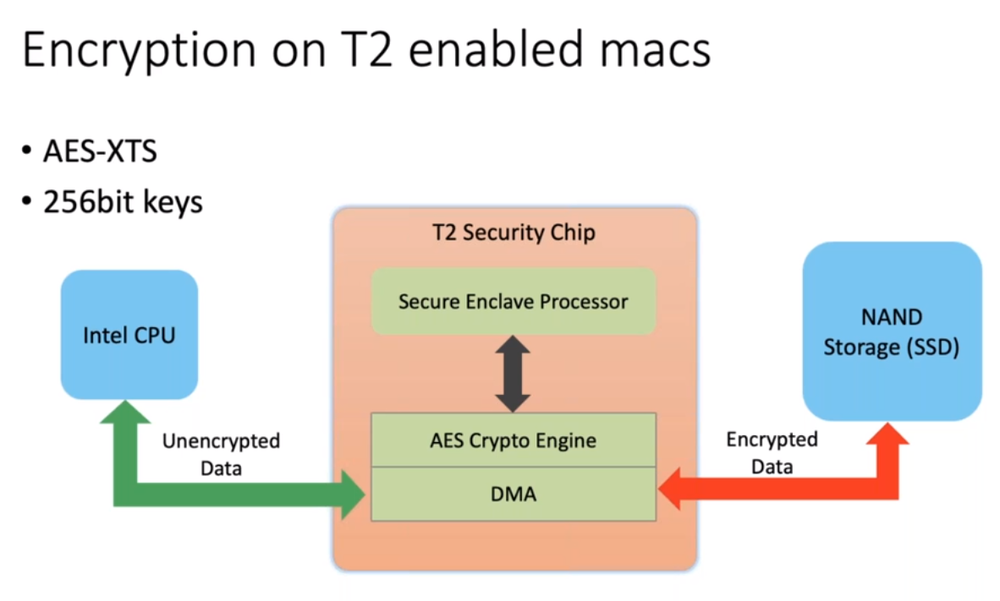
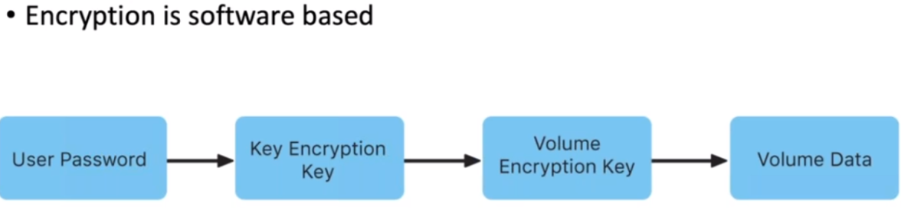
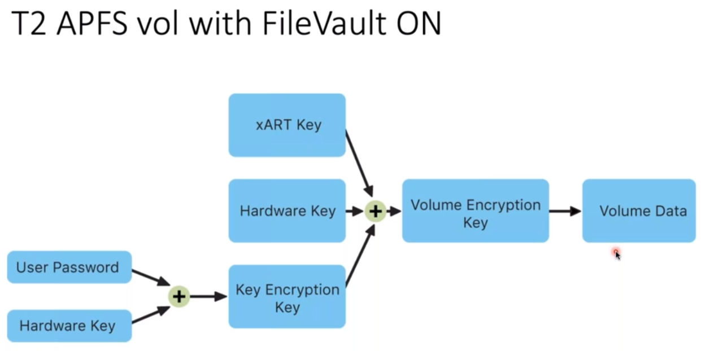
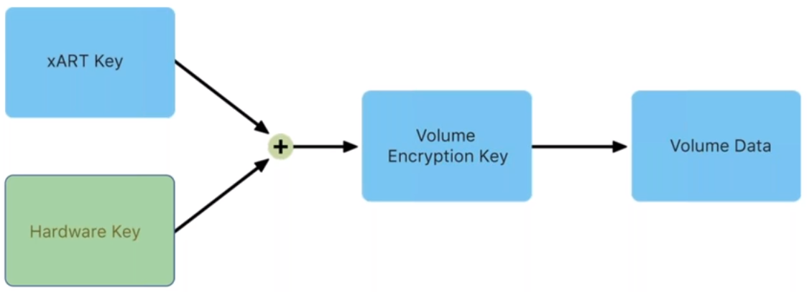
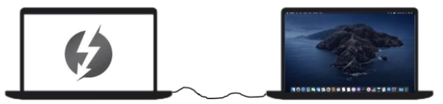
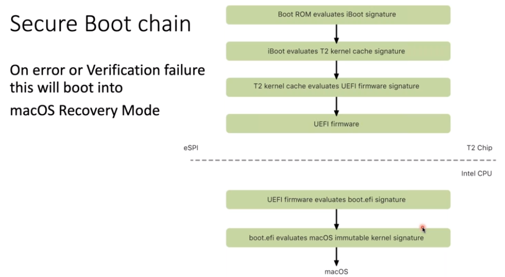
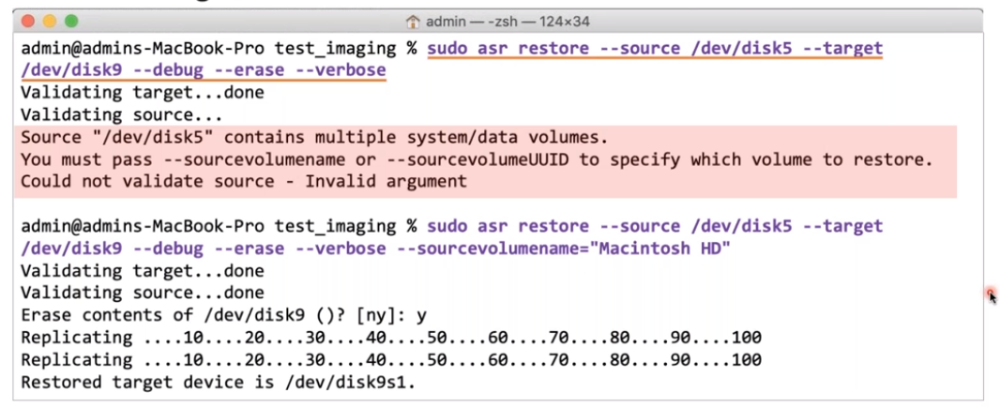

## macOS Forensics: The Next Level - Taming the T2 Chip & More

Yogesh Khatri - created mac-apt

Alexandra Cartwright

- [Check Out Later](#Check-Out-Later)

  

### Summary

- [T2 chip](#T2-Chip) - **ONLY ENCRYPTS APFS VOLUMES**
- [Image Acquisition How-To](#Best-way-to-Image-a-Mac)
- [Snapshot](#Accessing-Snapshots)
- Processing with Mac_apt (artifact parser of disk images)

### T2 Chip

- Secure Enclave (aka a data diode)

  - fingerprint and encryption keys

- System Information –> System Report -> Hardware -> Controller -> Model Name

- Uses AES-XTS (256b)

  

## FileVault + T1 Chip

## FileVault + T2 Chip

## No FileVault + T2 Chip (HW key is physically embedded)

#### What is encrypted?

- **APFS volumes only!**

### Best way to Image a Mac

Use Target Disk Mode. Turns Mac into a giant external hard drive. (`T` key during boot; ic below you see so you know it is in TDM.) then thunderbolt cable.

- Mac mounts always as Read/Write. So must use disk arbitration tool. See Disk-Arbitrator tool from https://github.com/aburgh/Disk-Arbitrator

### Can we boot into Linux Forensic Boot Distro

[Guymager](https://guymager.sourceforge.io/) with DEFT Zero

- **Now**, with T2 and NVMe SSD
  - Secure Boot needs to be disabled.
  - Apparently only Arch Linux has ability
  - Would use [Guymager](https://guymager.sourceforge.io/)

### Build own MacOS forensics Boot Disk

- Need a macOS installer for Catalina, SSD, and disk arbitration program to prevent automatic RW mounting procedure.

1. GUID as APFS to set up external disk
2. Install MacOS on external (15-45 min)
3. Go to R3ecovery Mode then Utilities –> Startup security utility –>turn off ('no security') secure boot and also allow booting from external medium
4. Turn off System Integrity Protection (SIP): `csrutil disable`
5. Boot into external by holding down option key
6. Note Disk_arbitrator does not block internal disks at boot. Can use https://github.com/ydkhatri/macOS_FE
7. Allow Terminal Full Disk Access

### Begin Investigating

- `$diskutil list`
- `$diskutil apfs list`
  - FileVault: No (Encrypted at Rest)
  - FileVault: Yes (Locked) –> `$diskutil apfs unlockVolume {disk3s1}` –> then enter password
    - Error might occur when unlock and mount in the same cmd
    - Rerun `$diskutil apfs list` to confirm it unlocked (`>FileVault: Yes (Unlocked)`) then mount

#### T2 APFS Imaging

1. Careful about document revision service: `$sudo launchctl unload /ystem/Library/LaunchDaemons/com.apple.revisiond.plist` – run twice for good measure until get "could not find specified service" output.

2. hdiutil to create DMG file: `$hdiutil create -fs APFS -size 120GB ssd.dmg` – make sure to give slightly larger size than that being acquired.

3. Attach DMG with dhiutil to attach to system as RW: `$sudo hdiutil attach -nomount ssd.dmg`

4. `$asr` (Apple system restore) will read the encrypted data from disk and then writeback unencrypted data to DMG. **Be careful, just as dangerous as dd**: `$sudo asr restore –source /dev/disk2 -–target /dev/disk9 –-debug –-erase verbose`.

   1. "If Can't restore a locked, encrypted volume" error, just `$mkdir origianl__mount`, `$sudo mount -t apfs -o rdonly disk2s1`, `$sudo umount original_mount`, then run the asr cmd again.
   2. You are getting Logical Images
   3. Included: All logical disk content (include all xattr), all timestamps (MACB) as original, even same inode numbers as source disk
   4. Excluded: Unallocated space and Snapshots; **however** snapshots can be imaged as entire new disk images
   5. When working with Catalina need to add `sourcevolumename`

   

5. Detach DMG: `$sudo hdiutil detatch /dev/disk8`

6. Profit

### To Verify Contents

1. sudo hdiutil attach –nmount  ssd.dmg
2. sudo diskutil mount readOnlly -0mountPoint image
3. sudo mount -t apfs -o rdonly disk2s1 original_mnt
4. Then use direqual are root

### Accessing Snapshots

- 24 hour interval

- Can automate this with [his script here](https://github.com/ydkhatri/macOS_FE/blob/master/MountingSnapshots/mount_snaps.sh)

  

  1. `sudo mount -t apfs -o rdonly disk2s1 original_mnt`
  2. `tmutil listlocalsnapshots <mountpoint (original mount)>` #lists snapshots

  3. `diskutil apfs listSnapshots disk2s1`
  4. `mkdir -p snap_oldest`
  5. `mount_apfs -s <snapshot (com.apple.TimeMachine.dateandtime.local)> <volume - where its currently mounted (original_mnt)> <directory - folder to mount snapshot (snap_oldest)>`
  6. Then use DirEqual between original_mnt and snap_oldest

  

  ### Mac_apt

  - macOS artifact Parsing Tool
  - written in python
  - Can take in vmdk, dd/raw, mounted, E01
  - spotlight and unified logs take a while to analyze
  - FAST mode takes about 30 minutes

  - [Github src](https://github.com/ydkhatri/mac_apt)

  

## Check Out Later

- [diskutil](https://ss64.com/osx/diskutil.html) cmd
- MacOs list with inode: `$ls-ali`
- https://github.com/ydkhatri/MacForensics
- DirEqual from Mac App Store
- Quicklook database cache
- https://github.com/abrignoni/iLEAPP
- [Mac_apt](https://github.com/ydkhatri/mac_apt)
- https://www.swiftforensics.com/