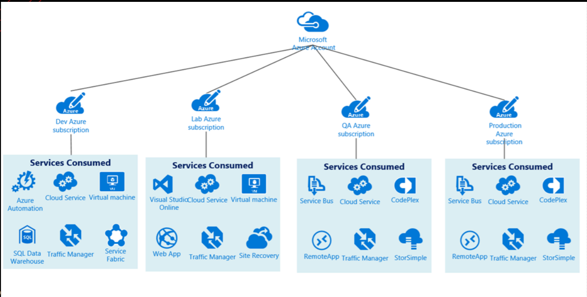

# BHIS: Breaching the Cloud Perimeter Training w/ Labs (4-Hours) 4/25/20

Taught by: Beau Bullock (@dafthack)

- [Check Out Later](#Check-Out-Later)

- [Lab setup link](https://www.blackhillsinfosec.com/training/breaching-the-cloud-perimeter-training/)

## Summary

1. [Cloud PenTest Auth](#Cloud-PenTest-Authorization)

2. [Cloud Auth Methods](#Cloud-Authentication-Methods)

3. [Recon](#Recon)
4. [Exploiting Misconfig Cloud Assets](#Exploiting-Misconfig-Cloud-Assets)
5. [Lab 1: S3 Bucket Pillaging](#Lab-1:-S3-Bucket-Pillaging)
6. [Gaining a Foothold](#Gaining-a-Foothold)
7. [Lab 2: Pillage Git Repos for Keys](#Lab-2:-Pillage-Git-Repos-for-Keys)
8. [Lab 3: Password Spraying](#Lab-3:-Password-Spraying)
9. [Lab 4: Access Tokens Auth](#Lab-4:-Access-Tokens-Auth)
10. [Post-Compromise Recon](#Post-Compromise-Recon)

## Intro

- No real "exploits", mainly misconfigurations
- Big 3: 
  - AWS: elastic
  - Azure
    - Not O365
  - Google Cloud Platform: big on Big-Data and ML
    - Not Gsuite/ GCP is infrastructure, not "productivity suites"

## Cloud Pentest Authorization

- no forms needed, but check ToS

- During initial phone call, ask for cloud assets specifically

- Don't DOS, fuzz, phish the cloud employees

- Look for secondary access points

  

## Cloud Authentication Methods

- Easy try, test a false user and you can usually figure out which method

1. Azure: Password Hash Synchronization

   - user creds are cloned/stored in Azure with **AD Connect service**

   - great b/c users can auth from anywhere
   - DirtJam from Azure security found vuln to dump all domain creds

2. Azure: Pass Through Authentication

   - Stored on-prem
   - Some vuln that sniffs creds over-the-wire

3. Azure: Active Directory Federation Services (ADFS)

   - Sets up a trust on-prem via an ADFS server through a web proxy with cookie
   - This is through a service but can be overcome via password spraying with Burp

4. Azure: Certificate-based auth

   - Used to use management certificates in the old days. Now with Azure Service Management they use Service Principals to setup certs

5. Conditional Access Policies

   - oAuth tokens
   - Desktop CLI tools (like Azume powershell modules) create tokens stored on disk
     - Then reuse these on other MS endpoints

6. AWS: Long-term access tokens

   - AWS programmatic access with secret keys (Diffie Helman-esq)

7. Google: Cloud Auth Methods

   - Web Access
   - API - OAuth 2.0
   - Access tokens - short lived
   - JSON Key Files - long-lived key-pairs. Can find this in CLI history or config files
   
     

2FA is usually a good defense, but not always enough as seen above.

## Recon

- To enumerate and identify an orgs resources/assets
- So orgs use cloud limited or fully-embraced by using the cloud for AD, production assets, security products, and more

1. Determine what services are in use (nmap)
   - determine AD (NTLM auth), mail gateways (MX records), web apps, file storage, etc.
2. Resolve names/ips and perform whois lookups to determine where they are hosted
   - Just look at IP space, blocks (Google uses 114, i think)
3. Use Search Engines
   - site:targetdomain.com -site:www.targetdomain.com (google dorking)
   - Baidu (Chinese search engine) and DuckDuckGo – best for searching email address
   - Tools: **Recon-NG**, OWASP Amass, Spiderfoot, **Gobuster**, Sublist3r
4. Certificate Transparency
   - framework that logs ssl/tls certs for websites ([Google explaination](https://www.certificate-transparency.org/))
   - A cert can have multiple domains!
   - Tools: [ctfr.py](https://forum.hackersploit.org/t/ctfr-a-simple-but-powerful-recon-tool/1187), [crt.sh](https://github.com/tdubs/crt.sh)
   - Internet-wide port scans: Shodan and [Censys.io](https://censys.io/)
5. DNS Bruteforcing
   - Good lists: [Miessler](https://github.com/danielmiessler/SecLists/tree/master/Discovery/DNS)
6. MX Records
   - Where and organization's email assets are hosted
   - Ex: `O365 = target-domain.mail.protection.outlook.com` or `Proofpoint = pphosted.com`
     - [PP attack](https://securityboulevard.com/2019/10/derbycon-2019-james-bowers-last-minute-offensive-machine-learning/)
   - Can be done with Recon-NG
7. Netblocks
   - ARIN Searches for finding ranges
   - https://whois.arin.net/ui/
   - Once found, resolve domains and compare to cloud service netblock ranges
     - Azure Public: https://www.microsoft.com/en-us/download/details.aspx?id=56519 
     - Azure US Gov: http://www.microsoft.com/en-us/download/details.aspx?id=57063
     - AWS https://ip-ranges.amazonaws.com/ip-ranges.json
     - GCP Netblocks makes it hard but can be done via dig
8. Employees
   - OSINT
   - LinkedIn to build a user list for password spraying
   - Find metadata and hidden information in documents. Brochures, spreadsheet data that should be publicly available and we are looking for the usernames that we can then add to spraying list
     - Tools: https://github.com/ElevenPaths/FOCA, https://github.com/dafthack/PowerMeta
9. User Enumeration
   - Exchange Webservices timing vuln
   - For on-prem OWA/EWS, use MailSniper
   - • https://github.com/dafthack/MSOLSpray 
10. Other tool sets
    - https://hackertarget.com/vulnerability-scanner/
    - https://www.threatcrowd.org/
    - https://dnsdumpster.com/

#### O365

Will tell you if domain is federated: https://login.microsoftonline.com/getuserrealm.srf?login=username@acmecomputercompany.com&xml=1

- Federated means ADFS is setup

#### Google

- If valid email, you will see a picture – don't need password to know the email exists

#### AWS

- S3Buckets - usually host static content; usually pictures

#### Box.com

- Company login portal: https://companyname.account.box.com
- Can find cached box account data via google dork `site:account.box.com`

## Exploiting Misconfig Cloud Assets

#### AWS 

- S3Bucket - typical file storage

- Elastic Block Storage - virtual hard disks

- [EBS Volumes DEFCON 27](https://www.youtube.com/watch?v=-LGR63yCTts) and [Dufflebag tool](https://github.com/BishopFox/dufflebag)
- AWS exploitation framework from Rhino Security Labs
- Rhino are the guys for AWS vulns
  - Cloud Goat
  - [Pacu](https://github.com/RhinoSecurityLabs/pacu) - bucket discovery, persistence, and more!

#### Azure

- Public Azure Blobs - like S3, blob is for unstructured data
- Containers and blobs can be publicly accessible via access policies
- Access Controls:
  - Private - no anonymous
  - Blob - anonymous read for blobs only
  - Container - anonymous read for everything
- Enumerate Azure Blobs via [MicroBurst](https://github.com/NetSPI/MicroBurst)
  - • `Invoke-EnumerateAzureBlobs` to brute force storage account names, containers, and files

#### Google Cloud Platform

- **Awesome tool for scanning all three cloud services for buckets and more ([cloud enum by Chris Moberly](https://github.com/initstring/cloud_enum))**

## Lab 1: S3 Bucket Pillaging

Using Pacu:

- `aws sts get-caller-identity` is to find info about your creds
- `list` will list all the modules (unauth recon, recon, enums, ec2, ebs_volume_snapshots, privesc, etc)

- If level of logging is high,
- AWS gaurdDuty will alert on specific user agents like Kali and Parrot and Pentoo.
  - Pacu - will change your user agent!

0. Setup: On-Start will ask for AWS keyID and secret and `>import_keys –all`

1. Connect: `>run s3__bucket_finder -d glitchcloud` # Finder module with Sublist3r
2. Enums files in bucket: `>aws s3 ls s3://glitchcloud`
3. Get files: `>aws s3 sync s3://glitchcloud s3-files-dir` # Creates directory on local FS

### S3 Code Injection

Can upload malicious JS to get executed by visitors by `$sudo aws s3 mv malicious.html s3://searched/<rename_to_index.html>`

- See March 2018, a crypto-miner malware was found to be loading on MSN's homepage. AOL's advertising platform having a writeable S3 bucket which was served by MSN ([Src](https://blog.trendmicro.com/trendlabs-security-intelligence/cryptocurrency-web-miner-script-injected-into-aol-advertising-platform/))

### Domain Hijacking

- When brute forcing subdomains for an org look for 404’s with ‘NoSuchBucket’ error

### Misc Searching for Open AWS Buckets

- https://medium.com/@grayhatwarfare/how-to-search-for-open-amazon-s3-buckets-and-their-contents-https-buckets-grayhatwarfare-com-577b7b437e01

## Gaining a Foothold

Key Disclosure in Public Repos

Azure Password Protection - prevents users from picking passwords with certain words like season, company name, etc.

Azure Smart Lockout - Locks out auth attempts whenever bruteforce or spray attempts are detected

### Webserver Exploitation

- Out-of-date web techs with known vulns – see searchsploit
- SQL or injection vulns
- Server-Side Request Forgery
- Creds in Metadata services, Certificates, Env vars, storage accounts

- To exploit: Use Mimikatz to export private keys on webservers and then use it to authenticate to Azure
- AWS Instance Metadata URL
  - Webserver that's setup on EC2 instances for IAM creds for access keys. This should only be reachable from the localhost however remote vulns can make it possible to reveal sensitive data
  - All 3 services have their own metadata url
  - IAM creds usually stored at http://x.x.x.254/latest/meta-data/iam/security-credentials/<IAM Role Name>
    - Can hit this externally when proxy service (like Nginx) is hosted in AWS: `$curl --proxy vulndomain.target.com:80 http://169.254.169.254/latest/meta-data/iam/security-credentials/ && echo`
    - CapitalOne Hack - Attacker exploited SSRF on EC2 server and accessed metadata URL to get IAM access keys. Then, used keys to dump S3 bucket containing 100 million individual’s data
    - AWS then updated metadata service (IMDSv2) and will search for an X-Forwarder header

### Phishing

- Still #1!
- But now phishes will be pivoted to cloud engineers, devs, devops to get that higher privileged access

1. Cred Harvesting/Session Hijacking
   - Steal creds and/or cookies
   - They auth and get real session cookies… we get them too.
   - Tools (Reverse Proxies): Evilginx2 and Modlishka
     - Also evades 2FA
   - G-Suite Calendar Event Injection via [MailSniper tool](https://github.com/dafthack/MailSniper) from BHIS
     - Silently injects events with no email required
     - Can create urgency – "Gotta check the agenda for the meeting that is coming up in 2 minutes I completely forgot about"
     - [More on this](https://www.blackhillsinfosec.com/google-calendar-event-injection-mailsniper/)
2. Remote workstation compromise
   - Access tokes found on disk
     - Google JSON Tokens and credentials.db (`~/.config/gcloud/credentials.db`)
     - Azure Cloud Service Packages (.cspkg)
     - Azure Development Files from **Visual Studio**
       - Azure Publish Settings Files (.publishsettings)
     - Azure possible other Azure service integrations (SQL, Storage)
     - Azure Cloud service package at `\bin\debug\publish`
     - Other Azure files to look at:
       - Web.config and App.config files in root of webapp ([Tool](https://github.com/fullmetalcache/sharpfiles))
       - Auth tokens:  `%USERPROFILE&\.azure\`. Remember this is short term auth
     - To find the login portals via 80/8080/443:
       - Use EyeWitness to quickly find domain to bruteforce
       - Or just query the AD from all hostnames and subdomains with git, code, repo, bitbucket, gitlab, etc.
     - Command `$history` in general

## Lab 2: Pillage Git Repos for Keys

- GitLeaks – Tool for searching Github or Gitlab repos
  - Can also use Gitrob and Truffle Hog, [ShhGit](https://shhgit.darkport.co.uk/)
- Looking for access in past commits
- Simple Docker run: `$sudo docker run --rm --name=gitleaks zricethezav/gitleaks -v -r https://github.com/<user>/<repo>` then look it up at `https://github.com/[git account]/[repo name]/commit/[commit ID]`

## Lab 3: Password Spraying

- Trying one password for every user at an org to avoid account lockouts
  - With lockout policy in place, this circumvents it
- Credential Stuffing - sharing same password across multiple accounts
- Breaches end up publicly posted which can then be used

## Lab 4: Access Tokens Auth

- Authenticate to Azure With Stolen Access Tokens
- GOAL: Steal Azure access tokens from a compromised system and use them to authenticate to Azure.
- Can steal profile access with two files `TokenCache.dat` & `AzureRmContext.json` in the `%USERPROFILE%\.Azure\` directory. Then just reload doing the following:

1. 

2. 

3. `C:> Import-AzContext -Profile 'C:\Temp\Live Tokens\StolenToken.json'`

**Done.**

## Post-Compromise Recon

Once you get access, recon should be done all over again.

IAM = Identity Access Management

ATP = MS Advanced Threat Protection (behavioral analysis)

### PrivEsc

AWS

- [WeirdAAL](https://github.com/carnal0wnage/weirdAAL) - tool for enumerating AWS access (with recon_all module)

Google

- [ScoutSuite](https://github.com/nccgroup/ScoutSuite) from NCC group - automated scanning for GCP

Azure

- Basic User can enumerate domain info 
- Tenant - user that signs up for the Azure account
- Subscriptions are thought of as software licenses, like O365
- Might be able to cross to other subscriptions

- User information
  - Roles: Owner, Contributor, Reader (RO attribute), User Access Administrator
  - Get the current user’s role assignment within a subscription: `PS> Get-AzRoleAssignment`
  - Still possible to access Azure AD user info via MSOnline cmdlets: `PS> Get-MSol[User,Group,GroupMember] -All`
- Azure Runbooks automate various tasks in Azure
- Get some Basic Azure Info: `PS> Get-MSolCompanyInformation` and `PS> Get-MSolCompanyInformation`
- [ROADtools Tool](https://github.com/dirkjanm/ROADtools) to exploit Azure AD 

## Check Out Later

- Global Address List (GAL) - https://milconnect.dmdc.osd.mil/milconnect/help/topics/global_address_list_overview.htm
- Google Cloud Platform (GCP) – check back to that thank you list at the beginning
- [Dirk jan Mollema - Im In Your Cloud Pwning Your Azure Environment - DEF CON 27 Conference](https://www.youtube.com/watch?v=xei8lAPitX8)
- Enum tool ([Cloud_enum](https://github.com/initstring/cloud_enum)) that can be then ported to firewall blacklists

**[To Top](#Summary)**

