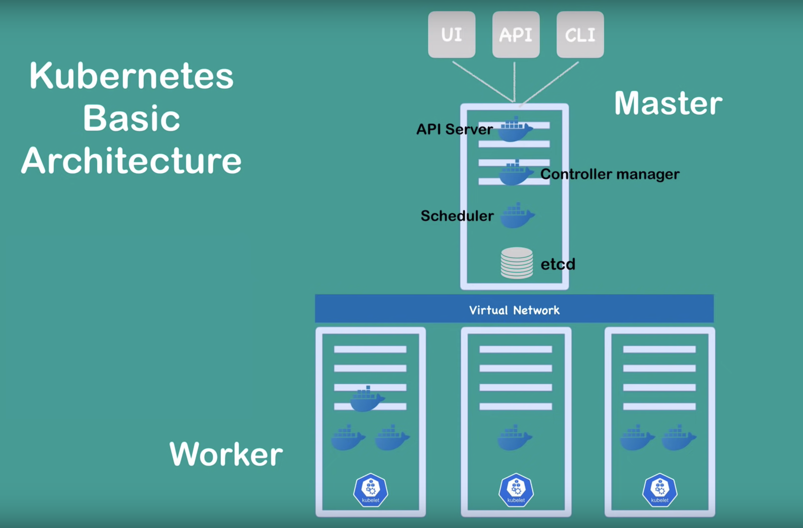

# Kubernetes

## What is it?

[Own Docs](https://kubernetes.io/docs/concepts/overview/what-is-kubernetes/)
- Google created and open-sourced in 2014



### Definitions

1. Node - runs containerized application(s). *May run multiple pods on a single node. Therein a single node may run multiple containers in each pod, too.* [Extra source](https://www.youtube.com/watch?v=umXEmn3cMWY)
   1. *kubelet* - a k8s agent
   2. *kube-proxy* - maintains network rules. Will default to OS packet filtering layers if it exists first.
   3. The containerize application itself aka **a container runtime** is the software responsible for running containers; Ex: Docker, containers, etc.
   
2. Cluster - When you deploy Kubernetes, you get a cluster. Every cluster has at least one worker node

3. Pod - a set of running nodes. **Smallest unit that a normal user will interact with.** Usually 1 pod per application (Ex: 1 pod for a java application). Has its own IP. [Extra source](https://softchris.github.io/pages/kubernetes-two.html#pods)
   1. Upon restart of a pod it will be given a new IP. That is why we identify pods by a *Service*; which holds a separate IP and is a load balancer.
   2. *Service* - logical set of Pods and a policy by which to access them. Different types like: ClusterIP, NodePort, LoadBalancer, ExternalName, and more.
   
   
4. Control Plane - container orchastration layer exposing an api and interfaces to manage (ie. Scheduling) and interact with containers within the cluster. Also responds automatically to cluster events. *Control plane components can be run on any machine in the cluster.* Aka this coordinates the cluster.
   1. *Kube-apiserver* - the main API server for K8s control that includes UI, API, and CLI access.
   2. *etcd* - store for all cluster data (raw data, statuses, snapshots, and more). [Etcd](https://etcd.io/docs/v3.5/quickstart/) is built with inspiration from Google's [Chubby lock service for distributive systems](https://static.googleusercontent.com/media/research.google.com/en//archive/chubby-osdi06.pdf).
   3. *Kube-scheduler* - if a pod is created with no assigned node it selects a node for them to run on automatically.
   4. *kube-controller-manager* - runs the controllers processes which watches the entire cluster and respond by moving from current to desired state; [Src](https://kubernetes.io/docs/concepts/overview/components/#kube-controller-manager). Some controllers include: Node, job, endpoint, service account & token
   5. *cloud-controller-manager* - lets you link your cluster into your cloud provider's API. Some of these controllers include Node, Route, and Service.
   
5. Addons
   1. Ex: DNS, Web UI, Container Resource Monitoring, Cluster Level Logging
   
   

Local Kubernetes Engines: [Minikube, kind, and k3s](https://brennerm.github.io/posts/minikube-vs-kind-vs-k3s.html)

## My Hello World K8s

https://kubebyexample.com/ - videos by RedHat employees.

[Great hands-on with inBrowser terminal](https://kubernetes.io/docs/tutorials/kubernetes-basics/)

[Hello Minikube](https://kubernetes.io/docs/tutorials/hello-minikube/) by K8s; also inBrowser terminal.

```bash
https://kubernetes.io/docs/tutorials/hello-minikube/

minikube dashboard
kubectl create deployment hello-node --image=k8s.gcr.io/echoserver:1.4
kubectl get deployments/pods/events/view

kubectl expose deployment hello-node --type=LoadBalancer --port=8080
kubectl get services
minikube service hello-node

kubectl delete service hello-node
kubectl delete deployment hello-node
```

**Kubectl basics**

- `kubectl action` (create, describe, get, logs, exec, etc) `resource` (node, container, etc)
- `kubectl get pods`
- `kubectl exec $POD_NAME -- bash`
- To get service description: `1) kubectl get services 2) kubectl describe services/$service_name`
  - Also `kubectl get deployments; kubectl describe deployments/$deployment_name
- `kubectl get services/kubernetes-bootcamp -o go-template='{{(index .spec.clusterIP)}}'` - get clusterIP of specific service
- `kubectl get services/kubernetes-bootcamp -o go-template='{{(index .spec.ports).nodePort}}'` - will get node port

**K8s Deployment Configuration**

This is passed to the Control Plane to schedule your app(s) instances.

---------

Check out [this lab](https://softchris.github.io/pages/kubernetes-two.html#lab-fun-with-labels-and-kubectl)

Dependancies: Docker + Minikube + kubectl

## K8s Forensiscs

https://kubernetes.io/docs/tasks/debug-application-cluster/audit/

- `kubectl describe pods`, Events section ==> `kubectl describe pods | awk '/Events:/,0'`
  - OR `kubectl get events`
- `minikube service hello-world`


[Kubernetes Logs on running pods](https://kubebyexample.com/en/learning-paths/kubernetes-fundamentals/kubernetes-logs) - `kubectl logs`

- Also [stern](https://github.com/wercker/stern)

