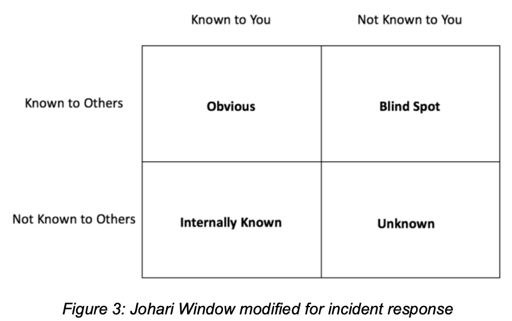

# AWS

- Works off [NIST SP 800-661](https://csrc.nist.gov/publications/detail/sp/800-61/rev-2/final) 
- Everything refers back to a company’s governance, risk management, and compliance (GRC) policies

- Has many native (guardDuty, SecurityHub, etc) and third-party (Deloitte, Accenture, etc) security products

### Security incident Response Simulations (SIRS):

1. Find issue
2. Identify skilled engineers - need those to builders and testers
3. Build realistic model
4. Build and test scenario elements
5. Invite other security individulas and cross-org participants
6. Run the sim
   - Examples are unauth'd changes to network configuation or resources, publically exposed creds, sensitive content made public via a misconfiguration, or air-gapped webserver that's talking to outside IP.
7. Iterate

### Automation

- Centralization vs Decentralization
- AWS Features: Lambda, Step Functions, Auto Remediation, SSM Agent, Fargate, EC2 (See *Infrastructure Domain Incidents* Steps)
  - Use AWS Systems Manager Run Command to capture Volatile Data
- Event-based and periodic scanning
- Runbooks (akin to Splunk Playbooks) 

Src: [Security IR Whitepaper](https://d1.awsstatic.com/whitepapers/aws_security_incident_response.pdf?did=wp_card&trk=wp_card), [AWS Config Git Rules](https://aws.amazon.com/config/)