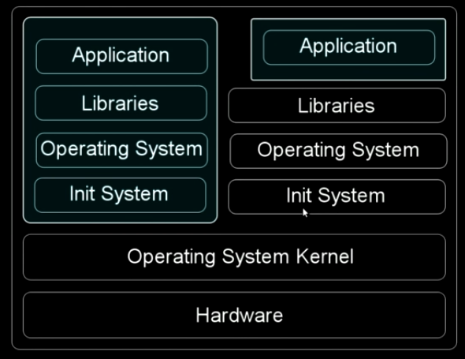

# Containers

**Definition**: Includes Azure, M365, containers, mobile, EVERYTHING

Container_examples :=  [LXC](https://en.wikipedia.org/wiki/LXC), [Solaris containers](https://en.wikipedia.org/wiki/Solaris_Containers), [Docker](https://en.wikipedia.org/wiki/Docker_(software)), Windows Server Core, Nano Server, Windows10 IoT Core, Kubernetes, Azure Stack, RHEL OpenShift ([Wikipedia](https://en.wikipedia.org/wiki/OS-level_virtualization) and [MSFT](https://docs.microsoft.com/en-us/virtualization/windowscontainers/about/)) & [rkt](https://www.openshift.com/learn/topics/rkt), & runC.

## Working Group Projects

[Docker](Docker/docker101.md)

- Make sure to verify images before you pull them: `$export DOCKER_CONTENT_TRUST=1`
- Take advantage of `$docker scan` with Synk

## Containers

| Hypervisors                                                  | Containers                                                   |
| ------------------------------------------------------------ | ------------------------------------------------------------ |
| Emulate Hardware                                             | Virtualize the OS subsystems                                 |
| Multiple Kernels                                             | Single Kernels (can't use Windows on Linux)                  |
| At a point, need more hardware (not elastic, host *reclaims* memory from VMs) | Elasticity aka resource decision-making (inate kernel efficiency) |
| A lot of ground work to work                                 | Easy to set up                                               |
| Gigabyte Image size                                          | Megabyte image sizes (Application container)                 |
| Hard to scale ([memory ballooning](https://en.wikipedia.org/wiki/Memory_ballooning)) | Easy to scale (cgroup conf)                                  |

In 2011, the [Linux Container API's](Docker/docker101.md#cgroups-and-namespaces) changed the way containers we implemented.

### Examples

- Parallels is the oldest container company; now called Odin. Released Virtuozzo in 1999.
- **LXC** was the first 'container' which is really just a set of userland tools that leverage cgroups and namespaces (cgroups came into the kernel in '06). AKA a 'kernel manipulation program' by .
  - No copy-on-write (made setup super slow and heavy)
  - Difficult to move images around (unlike docker push/pull)
- Systemd-nspawn is great but it [only does full system containment unlike Docker](https://www.reddit.com/r/linuxquestions/comments/2e6e7w/docker_vs_systemdnspawn_vs_lxc_how_do_they_differ/) which may contain single applications.
- OpenVZ - NOT based on cgroups & namespaces (unlike literally everything else in this space) [instead uses Travis CI]. Linux-based. Features include checkpoint_restore and venet (more efficient than veth Docker uses), and *ploop* (akin to device mapper). Open source version of Virtuozzo by Parallels.
- Jails/Zones- FreeBSD/Solaris-based. Great for hosting providers.
- Podman - a better alternative to Docker; just not as popular.
- Rkt - Application container (see pic above)

Sources:

- [James Bottomly from Odin](https://www.youtube.com/watch?v=YsYzMPptB-k)
- [Linux NS](https://www.polyglotdeveloper.com/basics/2016-05-08-Linux-namespaces-and-rise-of-containers/)

### Tools for Containers

#### Vulnerability Scanners

- [Trivy](https://github.com/aquasecurity/trivy)
- [AFL](https://github.com/google/AFL)
- [FFW](https://github.com/dobin/ffw)
- [Other list](https://github.com/cpuu/awesome-fuzzing#tools)

#### DFIR Tools

- [Google's Docker Explorer](https://github.com/google/docker-explorer) - really just a json parser and mount "snapshot"
- [Docker Forensics Toolkit](https://github.com/docker-forensics-toolkit/toolkit)

