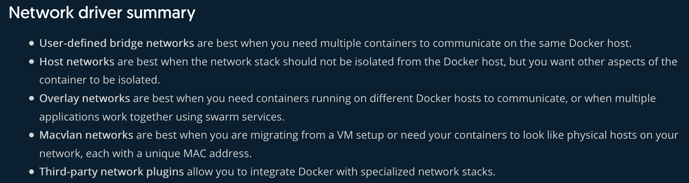

# Docker 101

## Table of Contents

- [Table of Contents](#table-of-contents)
  - [Low-Level Container Concepts](#low-level-container-concepts)
  - [Intro Videos](#intro-videos)
    - [Cgroups and Namespaces](#cgroups-and-namespaces)
  - [Intro Articles](#intro-articles)
  - [Cheatsheet](#cheatsheet)
- [Mounting (Persistance of Data)](#mounting-persistance-of-data)
  - [Types of Mounts](#types-of-mounts)
- [Docker Networking](#docker-networking)
  - [Setting up networking per container](#setting-up-networking-per-container)
  - [Networking Artifacts](#networking-artifacts)
- [DFIR Cloud (kubectl)](#dfir-cloud-kubectl)
- [Securing Docker Containers](#securing-docker-containers)

[Docker Networking](#docker-networking)

[DFIR Containers](#dfir-containers)
- [DFIR Cheatsheet](#dfir-cheatsheet)
- [K8s DFIR (Google talk)](#k8s-dfir-google-talk)
- [Securing Docker Containers Further](#securing-docker-containers)

<br/>

-------
Release at PyCon 2013

- [DFIR Use-Cases](useCases.md)

### Low-Level Container Concepts

Thanks [Ivan Velichko](https://twitter.com/iximiuz).


Docker utilizes higher-level and lower-level (container) runtime components. Examples of higher-level runtime engines include containerd, cri-o, and podman. While examples of Open Container Implementaiton (OCI) container runtime softwares are [runc](https://github.com/opencontainers/runc), [kata](https://katacontainers.io/), [gVisor (aka runsc)](https://gvisor.dev/), and [Firecracker](https://github.com/firecracker-microvm/firecracker); [source](https://www.padok.fr/en/blog/container-docker-oci). More on the differences at [iximiuz.com](https://iximiuz.com/en/posts/journey-from-containerization-to-orchestration-and-beyond/#container-management), and [this other iximiuz post](https://iximiuz.com/en/posts/implementing-container-runtime-shim/).


In conclusion, **(1)** Docker is the CLI that allows a user to build/pull/push/scan images, launch/pause/inspect/kill containers, create networks/forward ports, mount/unmount/remove volumes, and more. Docker has to interact with the **(2)** dockerd container engine when it wishes to utilizes lower-level functionality handled by those below this container *"stack"*. Container actions, monitoring, and administration control is then passed to a **(3)** container manager like [contianerd](https://iximiuz.com/en/posts/journey-from-containerization-to-orchestration-and-beyond/#containerd) which is responsible for  keeping track of multiple containers at a time incase the need ot be restarted on failure, resources may need to be released on termination, or it may need to pull images, unpack bundles, [configure the inter-container networking](https://iximiuz.com/en/posts/container-networking-is-simple/), store container logs, and more. Then comes the  **(4)** containerd-shim which intercepts and standardizes container communication streams (stdin, stdout, stderr) between the container manager and the low-level container runtime component. The shim also facilitates the `attach` functionality of [interacting with an already running container](https://iximiuz.com/en/posts/implementing-container-runtime-shim-3/). Last is the **(5)** low-level runtime software is something like runc which is actually responsible for creating a "container" with a [conf.json and a bundle directory](https://iximiuz.com/en/posts/implementing-container-runtime-shim/). A **(6)** container itself is just utilizing Linux [*namespaces* and *cgroups*](#cgroups-and-namespaces) (see below) to isolate a subset of resources and permissions, and includes a dedicated root file system [and a new process tree](https://iximiuz.com/en/posts/implementing-container-runtime-shim/#playing-with-runc).

**Sources**:

- https://iximiuz.com/en/posts/container-learning-path/
- https://iximiuz.com/en/posts/journey-from-containerization-to-orchestration-and-beyond
- https://iximiuz.com/en/posts/not-every-container-has-an-operating-system-inside/
- [Twitter: How to grasp Containers and Docker](https://twitter.com/iximiuz/status/1423984739514454033?ref_src=twsrc%5Etfw%7Ctwcamp%5Etweetembed%7Ctwterm%5E1423984739514454033%7Ctwgr%5E%7Ctwcon%5Es1_&ref_url=https%3A%2F%2Fiximiuz.com%2Fen%2Fposts%2Fcontainer-learning-path%2F)
- [Twitter: OCI/Docker containers](https://twitter.com/iximiuz/status/1259569908385529859?ref_src=twsrc%5Etfw%7Ctwcamp%5Etweetembed%7Ctwterm%5E1259569908385529859%7Ctwgr%5E%7Ctwcon%5Es1_&ref_url=https%3A%2F%2Fiximiuz.com%2Fen%2Fposts%2Fnot-every-container-has-an-operating-system-inside%2F)
- https://www.tutorialworks.com/difference-docker-containerd-runc-crio-oci/#cri-o

### Intro Videos

[Dockercon21 all videos](https://docker.events.cube365.net/dockercon-live/2021?utm_source=docker&utm_medium=webreferral&utm_campaign=web-page-referral)

[LiveOverflow's Docker NS](https://www.youtube.com/watch?v=-YnMr1lj4Z8)

#### Cgroups and Namespaces

[Liz Rice Docker conference talk](https://www.youtube.com/watch?v=8fi7uSYlOdc) && [Underlying software settings of Docker (technical)](https://www.youtube.com/watch?v=sK5i-N34im8) - "chroot on steroids"

- [cgroups](https://en.wikipedia.org/wiki/Cgroups#Redesign) := **limits** how much a proc can use (I/O, ACL-ish, CPU & Mem)
  - Memory cgroup accounting = where each memory page is "charged" to a group
    - Limits: hard limits will kill procs via Out-of-Memory (OOM) killer. Soft limit procs will have their memory reclaimed only if system memory is close to absolute limit
      - May set limits on physical, kernel, and total memory.
      - OOM killer with oom-notifier will freeze all procs in groups to still kill proc or less drastic measure like moving proc to different group.
  - HugeTLB cgroup = when procs share their memory pages with one another as long as in same cgroup.
  - BlockIO cgroup = tracks and may throttle I/O per group: sync vs async and R/W's
    - *Since write are cached first, throttle won't be noticable at first
  - Net_cls/prio cgroup = sets traffic class/priority for egress only.
  - Device cgroup = R/W/mknod permissions
    - /dev/net/tun (network iface manipulation) & /dev/fuse (filesystem user iface)
  - Freezer cgroup = similar to SIGSTOP/SIGCONT but for cgroup procs
  - cgroups wars: systemd vs cgmanager vs ...
- [namespaces](https://en.wikipedia.org/wiki/Linux_namespaces#UTS) := limits what procs can see. "You can't use/limit what you can't see" @cgroups
  - PID namespace = Only those within same namespace may see each other
    - If PID 1 (init) goes away, entire namespace is killed
    - PID namespaces may be nested causing a process to have multiple PIDs; one per nested namespace
  - **Net namespace** = procs have own network iface (including lo), routing tbales, iptable rules, sockets
    - May move ifaces between containers with `veth`
    - Also may pair container's veth with localhost to create a virtual switch
  - mnt namespace = process may have their own root; and their own /tmp (normal for unix users for scratchpad with low integrity security)
    - Enter bind-mount
  - ipc namespace = includes semaphores, message queues, and shared memory without risks of conflicts
  - UTS (Unix Time-sharing) = allows for a single system to have different host and domain names to different processes.
  - user namespace = maps uid/gids
    - inside container you're uid 1 but outside of container you are uid 1234
  - NS Manipulation: created with clone() syscall
    - May view namespaces via /proc/\<pid\>/ns
    - May enter a namespace with setns()
- Copy-on-write storage := create new container instantly instead of copying entire filesystem
  - Enhances Docker by reducing footprint and 'boot' times of newly created containers
  - Many options; keeps track of what has changed
    - Options: AUFS, device mapper thinp, BTRFS or ZFS
  - [Deep dive into docker storage drivers Youtube](https://www.youtube.com/watch?v=9oh_M11-foU)
- Docker Engine
  - Daemon controlled by REST APIs
  - No longer uses its own libcontainer runtime

### Intro Articles

[Actual Docker getting-started pages](https://docs.docker.com/get-started)

["Play with Docker" from docker.com](https://www.docker.com/play-with-docker)

TeamTNT :heart:'s Containers - [Lacework article](https://www.lacework.com/taking-teamtnt-docker-images-offline/), [malpedia (their full works)](https://malpedia.caad.fkie.fraunhofer.de/actor/teamtnt)

### Cheatsheet

```bash
docker exec -it <container_name> bash # "jump" into an already running instance. (interactive terminal)
docker volume create <volume_name> # create a named volume
# May also just `run -v <container>` as Docker will create volume automatically.
```

To clean up your Docker environment

```bash
alias dockerclean='docker rm $(docker ps -a -q -f status=exited); docker system prune -a'
```

To inspect container filesystems ([src](https://blog.px.dev/container-filesystems/))

```bash
# 1. Obvious
docker exec -it mycontainer /bin/bash

# 2. Using nsenter
# Get the host PID of the process in the container
PID=$(docker container inspect mycontainer | jq '.[0].State.Pid')
# Use nsenter to go into the container’s mount namespace.
sudo nsenter -m -t $PID /bin/bash

# 3. Copy with Docker
docker cp mycontainer:/path/to/file file
docker export mycontainer -o container_fs.tar

# 4. Find Filesystem on Host
docker container inspect mycontainer | jq '.[0].GraphDriver'

# 5. /proc/<pid>/{root,mountinfo}
sudo ls /proc/<pid>/root
```


| Directory Structure | Purpose                                                      |
| ------------------- | ------------------------------------------------------------ |
| LowerDir            | Includes the filesystems of all the layers inside the container except the last one |
| UpperDir            | The filesystem of the top-most layer of the container. This is also where any run-time modifications are reflected. |
| MergedDir           | A combined view of all the layers of the filesystem.         |
| WorkDir             | An internal working directory used to manage the filesystem. |

To copy volume data out of a running container

```bash
1. docker volume ls # get volume name
2. docker volume inspect <volume_name> # get volume path in contianer
3. docker ps # get container-id
3b. docker ps -a --filter volume=<volume_name> # If unsure which container is running the volume you are interested in.
4. docker cp <container-id>:<src> <dest_on_host>
```

To acquire data from a volume

```bash
1. docker volume ls # get volume name
2. docker run -d -v <volume_name>:<container_mount_path> alpine tail -f /dev/null # Mount the volume to a dummy container
3. docker cp <container-id>:<src> <dest_on_host>
```

"Where is Docker *actually* storing my data when I use a named volume?" - `$docker volume inspect`
- Shows files in volume: `/var/lib/docker/volumes/<volume_name/id>/_data/<file(s)_of_interest>`
- Stdout from a given container: `/var/lib/docker/containers/<container id>/<container id>-json.log`

<br/>

Check out [Fileless-ish Docker](https://docs.docker.com/develop/develop-images/dockerfile_best-practices/#pipe-dockerfile-through-stdin):

    *echo -e 'FROM busybox\nRUN echo "hello world"' | docker build -*

OR

```bash
docker build -<<EOF
FROM busybox
RUN echo "hello world"
EOF
```

## Mounting (Persistence of Data)

### Types of Mounts

There are three types of mounts: named volume mounts, bind volume mounts, and tmpfs mounts. Volume mounts persist after the container is shutdown while tmpfs does not.

1. (Named) Volume mounts are managed by docker. Advantageous over bind mounts.

   1. `$docker volume create <volume_name>`
   2. `$docker run -d --name devtest -v <volume_name>:/app nginx:latest`

2. [Bind mounts](https://docs.docker.com/storage/bind-mounts/) (aka host volumes) when file/folder on a host is mounted to a container. May have permission issues. You're also breaking Docker's mantra of containerization by adding a non-transferable volume into the mix. Check the [use cases](https://docs.docker.com/storage/#good-use-cases-for-bind-mounts) if you're still uncertain about how and why we use bind mounts.

   1. Ex: `$ docker run -d -it --name devtest --mount type=bind,source="$(pwd)"/target,target=/app nginx:latest`

3. [tmpfs](https://docs.docker.com/storage/tmpfs/)  may only be used on Linux hosts however it is not required to use utilize the containers writable layer in order to tempoararily store data.

4. *BONUS*: [Named pipes](https://docs.microsoft.com/en-us/windows/win32/ipc/named-pipes) may be utilizing when running Docker on a Windows system.

   ```
   Common use case is to run a third-party tool inside of a container and connect to the Docker Engine API using a named pipe.
   ```

[Difference between Named and Host volumes](https://serverfault.com/questions/996785/docker-volumes-vs-mount-binds-what-are-the-use-cases)

[Storage Driver](https://docs.docker.com/storage/storagedriver/select-storage-driver/) are required to create data in the writable layer of any container. These are in the form of plugins ie. NFS, SFTP, etc. They are especially useful when running clustered environment. Trivially, since these volumes are utilizing the writable layer we are only talking about volume and bind mount types.

<br/>

You should use secrets to store sensitive data.


## Docker Networking

Types of network configurations ([network drivers](https://docs.docker.com/network/))



Custom network plugins may be found [here](https://docs.docker.com/engine/extend/plugins_services/).

### Setting up networking per container

In Dockerfile, *EXPOSE 80* then `$docker -p 80:80`

### Networking Artifacts

## DFIR Containers

### DFIR CheatSheet

```bash
docker continaer inspect <container_name> | tee container.info # Get info on a single container
docker container top <container_name> -aux | tee processes.txt # Get process info on a single container
docker container cp <container_name>:<source_file> # Will copy file from container to host
docker container export -o <file.out> <container_name> # Export entire filesystem
tar -zcf <volumen_name>.tar.gz /var/lib/docker/volumes/<volume_name> # Copy volume to host
```

Source: <https://netsecninja.github.io/dfir-notes/docker/>

### K8s DFIR (Google talk)

[Maya Kaczorowski KubeCon 2019 (Google)](https://www.youtube.com/watch?v=MyXROAqO7YI)

Artifacts: Logs, Disks, Live Info

1. Logs
   1. System, Application, Network, Deployment, Cloud, Container
   2. Infrastructure (Ex: [GCP GKE logs](https://medium.com/google-cloud/a-quick-gke-logs-primer-a978f60daa7)), Kubernetes (kubectl), **OS**, Application, Audit (who did it) logs
      1. Audit Logs := VPC Flow Logs when using GCP
      2. OS Logs := Network connections, user logins, ssh sessions, executions like execve() via logging agent like [fluentd](https://docs.docker.com/config/containers/logging/fluentd/).
   3. Want to use a Logging Infrastructure like
   4. Tools: `$docker logs $CONTAINERID`
2. Disks
   1. Use cloud APIs to take snapshot
   2. Tool: [Google's Docker Explorer](https://github.com/google/docker-explorer) - really just a json parser and mount "snapshot"
   3. Tools: Sysdig, `$docker export $CONTAINER_ID > evidence_image.tar` then `$log2timeline.py --process_archives evidence.plaso evidence.tar`
3. Live Info
   1. Client agents or container sidecar
   2. Tool: Grr, `$docker pause`, `$docker top $CONTAINER_ID -o start,user,pid,cmd`, `$docker diff $CONTAINER_ID > changed_files.txt`, `$docker container port CONTAINER`

Sources:

- <https://www.compuquip.com/blog/docker-forensics-and-misconfigurations-in-containers>
- <https://aws.github.io/aws-eks-best-practices/security/docs/incidents/>

### Securing Docker Containers

- Automatically create AppArmor configs with [Bane](https://github.com/genuinetools/bane#usage)
- Use Hadolint to lint your Dockerfile's
