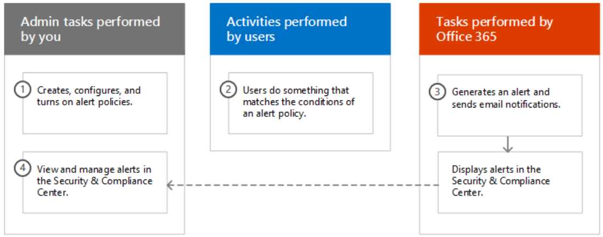

# MS O365 Notes

## CISA Reports

[Src: AA20-120A](https://www.us-cert.gov/ncas/alerts/aa20-120a) - Basic Mitigations

- MFA for admin and regular users

  - In Azure AD, Global Admins have the highest priv (equivalent to Domain Admin). MFA is NOT enabled by default.
  - Windows has *Security Defaults*- once turned on, alleviates MFA config, it will also block legacy auth methods, and many other problems. ([link](https://docs.microsoft.com/en-us/azure/active-directory/fundamentals/concept-fundamentals-security-defaults))
  - [Troy Hunt's Password list](https://www.ncsc.gov.uk/static-assets/documents/PwnedPasswordsTop100k.txt)

- Assign roles with Role-based Access Control

  - Like Linux, create a new account that can sudo instead of using the 'root' account.
  - Azure AD's have built-in admin roles that allow for "least-privilege" to be checked off. The many roles can be found [here](https://docs.microsoft.com/en-us/azure/active-directory/users-groups-roles/directory-assign-admin-roles#available-roles).

- Enable Unified Audit Log

  - Contains Exchange, SharePoint, OneDrive, Azure AD, MS Teams, PowerBI, and more logs
  - An admin must enable them in the Security and Compliance Center

- Disable legacy protocol authentication when appropriate

  - POP3, IMAP, MAPI, and SMTP do not support MFA. As of recent, IAMP, SMTP, POP, EXO, EWS now has OAuth2.0 capabilities (More on [this here](https://www.vansurksum.com/2020/03/01/microsoft-is-going-to-disable-basic-legacy-authentication-for-exchange-online-what-does-that-actually-mean-and-does-that-impact-me/)). Should use Token based authentication via OAuth 2.0 and the Active Directory Authentication Library.
  - One approach to mitigate this issue is to inventory users who still require the use of a legacy email client and legacy email protocols and only grant access to those protocols for those select users.
  - Can read exactly how to do this, via *Conditional Access*, [here](https://docs.microsoft.com/en-us/azure/active-directory/conditional-access/block-legacy-authentication).

- Enable logging with Azure/O365

  - Create and enable alerts within the Security and Compliance Center (more on [this here](https://docs.microsoft.com/en-us/microsoft-365/compliance/alert-policies?view=o365-worldwide)).
  - At a minimum, CISA recommends enabling alerts for logins from suspicious locations and for accounts exceeding sent email thresholds.

  

  - Incorporate Microsoft Secure Score
    - Helps with the dashboard for ["Metrics and Trends"](https://docs.microsoft.com/en-us/microsoft-365/security/mtp/microsoft-secure-score?view=o365-worldwide).
  - Integrate Logs with your SIEM.