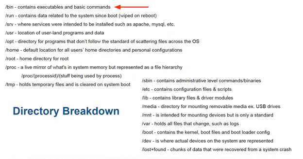
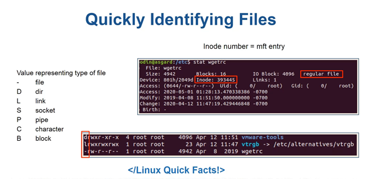
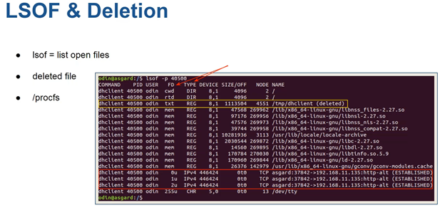

# Magnet/Champlain College: Performing Linux Forensic Analysis and Why You Should Care!

## Linux Intro

## Basic Investigation Walkthrough

1. Sudo netstat -lpeanut à Get pid
2. Lsof -p <pid>
3. Ps aux | grep [pid,<name> à Get path/cmd
4. Retrieve file on disk?
5. Retrieve file from /proc. In /proc/pid
   1. Task/pid/children
   2. Cmdline
   3. Environ
   4. Arp – for hardware address
   5. Status – for ppid and pid
   6. Exe – just cp or cat to file to extract from memory
6. Find / -type f -exec md5sum {} \; | grep <md5> # Poor mans file finder

## Misc

**Makes sure save to mount without tampering**

`Sudo mount -o remount,noatime /dev/… <dst>`

**Timestamps using debugfs**

`$sudo debugfs -R ‘stat <inode>’ path`

**Check sudo group**

`Grep -E ‘<sus user accounts>’ /etc/group`

**Search for Files by Time**

Search for files that had their metadata changed within the last *n* days

-     $find / -type f -newermt 2019-10-04 #modified time
-     $find / -type f -newerct <time> # inode status change time

## Hunt last logins

-     Last
-     W
-     Lastlog
-     /var/log/auth.log
-     Last -f /var/log/wtmp
-     Last -f /var/log/btmp

### Dump wtmp/btmp

1. Sudo debugfs /dev/….
2. Cd /var/log
3. Ls
4. Imap <id/inode/something>
5. Dump_inode wtmp /media/externaldev/case/wtmp.dump
6. Strings wtmp.dump

This was the exact same talk from 2019: <https://www.osdfcon.org/presentations/2019/Ali-Hadi_Performing-Linux-Forensic-Analysis-and-Why-You-Should-Care.pdf>
