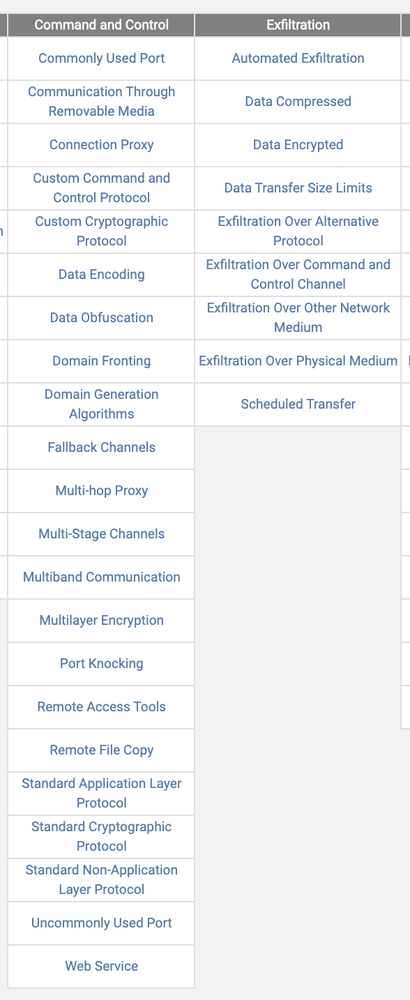
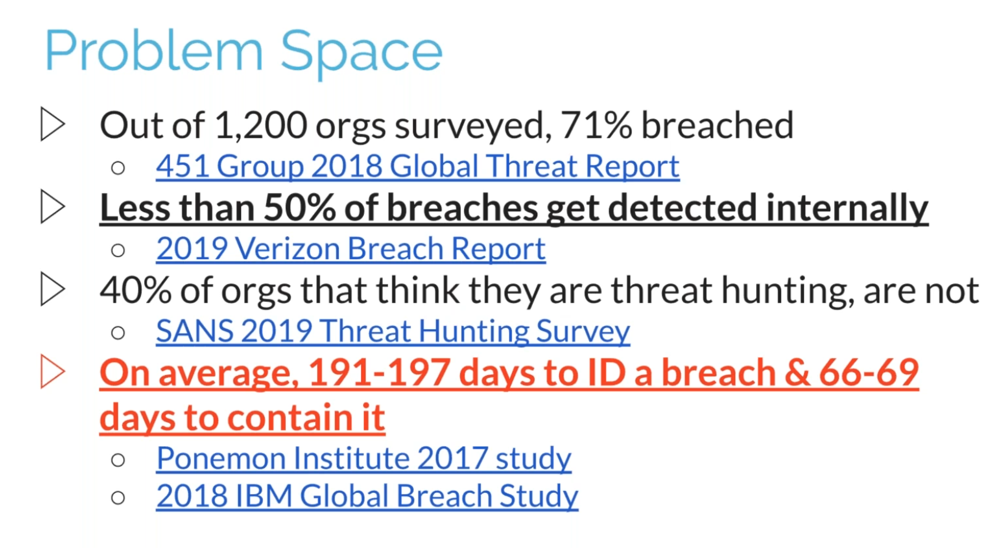
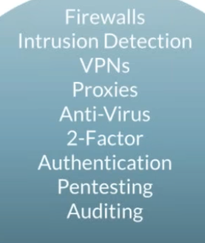

# BlackHills Cyber Threat Hunting Training (4/4/20)

## Contents

- [Introduction](#Intro)

- [Commands and Control](#C2)

- [Process](#Process)

- [Identifiers/IoCs in Network Traffic](#IoCs)

- [C2 FOSS Tools](#FOSS-Tools)

- [Summary/TLDR](#Summary)

- [Things to look at later on](#Things-to-look-for-later-(in-order))

  

[Slideshow found](https://www.activecountermeasures.com/acm-bhis-presentations) then go to CyberThreatHuntingTraining_JohnStrand_Full.pdf in the Network Cyber Threat Hunter Training slideshow

- Labs start at slide 134

## Intro

- Cylance is the big bully of cyber

  - See more at [Sacred Cash Cow Tipping](https://www.blackhillsinfosec.com/webcast-sacred-cash-cow-tipping-2020/)

- Most of today is about these topics from MITRE Matrix:

  

## C2

Every attack: escalate privileges, move laterally , establish C2 (what we're talking about today)

### Company/Victim Firewalls

- Most companies DONT filter the outbound traffic, but do filter ingress traffic.
  
  - [Marcus J. Ranum](https://en.wikipedia.org/wiki/Marcus_J._Ranum) founded firewalls
- Certain IDS/FW's do check if packets match the port. 
  - Ex: is this packet that leaves from port 80 really HTTP?
  - Tools: https://www.snort.org/, https://suricata-ids.org/
- How does an attacker get in? (Spear-)Phishing
  - Done via algorithms with bad-word lists. 
  - Email filtering products (EDRs, [MSSP](https://www.gartner.com/en/information-technology/glossary/mssp-managed-security-service-provider) tools) also have white-word lists which would is bad.
    - Ex: The white list has the word "spreadsheet" to automatically go through inspection. However 'download my (malicious) spreadsheet' is super common for attackers.
    - Ex 2: Spear Phish - license plate --> Metadata from kids soccer team --> email with "Updated practice soccer" --> People will click. *The Creepy Line* (Google)
- Pentesters will never be like attackers
  - [Attackers] Find a trusted network ('doctors forum'), then put the C2 on their server
  - [Pentesters] Do instead: [Domain fronting](https://attack.mitre.org/techniques/T1172/) via 
    - Colbalt Strike 
    - [Sneaky-Creeper Github](https://github.com/DakotaNelson/sneaky-creeper)
    - [Gcat - what russians used](https://github.com/byt3bl33d3r/gcat)
- Why Signature-based (not threat hunting) products are a problem

  - Per Verizon Source, orgs discovered that they were breached from an external monitoring service (69.7% [lol])

What is threat hunting? Include all systems (laptops, cell, IoT, tablets, cameras, etc - see pic below for more)

- Answer: Find unknowns and anomalies, create better filters, repeat
- Threat hunting is **not**... Blacklist detection, IOCs, Provided by an EDR (aka hitting the easy button)
  - This is what MSSP and companies like them do. "Everything in one pane of glass" *and* "Log everything" (while the log/search cost is enormous).

### Misc

- Transunion account is great for phishing
- [Compliance Master Map](https://www.auditscripts.com/download/2742/)
  - [Compilance Tool xls](https://www.auditscripts.com/download/4229/)

---

## Process

- [JPCERTCC - LogonTracer](https://github.com/JPCERTCC/LogonTracer/wiki) - Analyzing Windows active directory event logs.
- Fun fact: [SCO unix](https://en.wikipedia.org/wiki/SCO%E2%80%93Linux_disputes) vs [IBM](https://en.wikipedia.org/wiki/SCO%E2%80%93Linux_disputes#SCO_v._IBM) and [Autozone](https://en.wikipedia.org/wiki/SCO%E2%80%93Linux_disputes#SCO_v._AutoZone) -- when they thought they could sue people for using linux

  - C2 Hunting has blind spots
    - Stuxnet - USB only; NotPetya - didn't ping a C2, just search-and-destroy

  ### Where to start

  - Remember logging everything is expensive. Also if you are logging everything most/all of the logs are white noise
  - More data == better fidelity (min of 12 hours recommended, 24 hrs is ideal)
  - Analyze communication pairs (egress packet ip/port to ingress packet's ip/port)
  - Suricata -- emerging threats give many false positives

  ### What to look for first

  - Persistent connections: internal to external
  - Look for signs of automation
    - not all automation is evil!
  - Focus on IP to IP however C2 can jump ports and protocols (ex: Sneaky-Creapers)
  - Long Connections - firewall state tables or even just basic wireshark stats can tell you

1. Beacons

   - Will "check in" to C2 server, else sleep -- this still can be found via `$ps`
   - session size is the same
   - fairly predictable timing (jitter or once/min)
   - Can use _kmeans_ clustering (think crayon color-clustering)

2. Long Connections + Beacon

   ![image] (BHCyber_Threat_Hunting_Training.assets/image%20(1).png)

### What to Look for Second

- external ip on blacklist
- Domain < 30 days old
- Unexpected protocol on well-known port
- client "signature" unique within environment: Attackers using different domains

### C2 Dections Techniques

1. Identify persisten conns
   - Will try to blend in
   - To search IP's use ipvoid.com
2. internal to external
3. are host in constant comm?
4. does the conn appear to be automated?
5. can the connections be explained? valid business need, etc

### Techniques - Actual Start

- Packet Captures or Bro/Zeek (recommended Zeek)
  - If UDP, very hard since stateless protocol; have to identify a timeout for session reset
- Firewalls handle timing differently! TTL (Time to live), not duration usually.
- Could use tshark. [Heres how Active Countermeasurers uses it](https://www.activecountermeasures.com/tag/tshark)
  - ` frame.time_delta_displayed` is a great way to check for similar intervals (beaconing!)
  - tshark with R analysis -- if min is close to mean value could indicate heartbeat. If stdev is low could also indicate heartbeat.
- Beacon 'jitter' - introducing variance/*random* into timing; but not really cause PRNG. [See pic]

-6020760.png)

#### Potential false positives

- Things that have long connections: BGP, chat programs, dynamic web pages (weather radars)
- You are looking for: perfectly randomized beacon
- Things that do beacon: NTP, internal DNS forwarder to external DNS resolvers, chat programs, security software

### Next

- Shodan and other hunting with Threat Feeds

---

## IoCs

- Gotta develop a threat rating system

- Ex: VSAgent is a base64 view state parameter with tcpdump
  - viewstate is like a session id

- Protocols to match port (Palo Alto was first FW to do state inspection) -- indication of tunneling
  - ICMP/Ping backdoor - ping packets that don't echo what was queried
- Unexpected protocol use
  - Ex: Using 443 (knowing its TLS and IDS' shouldn't block) for non-https traffic 

- Misc: Chrome remote desktop (TCP5222), VNC (TCP/5800), Modbus (TCP/502)

#### DNS

- Using DNS as C2 (super easy)
  - Check FQDN that arent normal (normal: [google, akamia, amazon, etc])
    - Extract DNS traffic from PCAPs then sort and count uniq's (`$|sort|uniq -c|sort -rn` [reference from [linux dojo talk from before (exact time in Utube vid)](https://youtu.be/-jNkjuWMFrk?t=918)])
  - Match DNS DST_IP queries!
    - Careful of DNS-over-HTTPS
    - Careful of Direct IP connections
  - Look for HTTP user agent strings! 
    - `Python-urllibb` :: might be legitament or not
    - Find least-use user agent

#### TLS/SSL

- Can find brand new SSL/TLS hashes
- Zeek + JA3 ([salesforce github](https://github.com/salesforce/ja3))

#### Invalid certificate checks

- Want to identify invalid, "unable to get local issuer certificate"
- Extended Validation (EV) certs are more trusted and can assign negative threat points
- Frindge-case: [Iran](https://www.wired.com/2011/03/comodo-hack/)

#### Check target IP Address

- Start simple
  - ASNs (zip codes for the internet) -- who manages them? (probaly Microsoft [azure, xbox, etc] and Amazon)
    - BGP Ranking (bgpranking.circl.lu) -- a neighborhood you don't want your computer talking to
  - Geolocation info? that one website for osint
    - Those that aren't VPN'd
    - can use traceroute (next to last hop)
  - IP delegation
  - PTR records

- Threat intel

  - .png)
  - Sometimes Bing bot, MSN bot (web crawlers)
  - Should be secondary usage. Use your own ingeniuty and common sense before relying on this.

  ##### Ephemeral Threat Intel

  - intel that changes rapidly
  - should be done by your av though
  - Ex of this: IP's, hashes, etc

  ##### Durable Threat Intel

  - techniques that are used and reused

- Using Sysmon

- Using [Sigma](https://github.com/Neo23x0/sigma) - Generic Signature Format for SIEM Systems

---

## FOSS Tools

- Start with a scoring system
- Then persistent connections ('internal to external' then beacons then long connections)
- Then analyze protocol and endpoint attributes (evidence of untrusted communications)

1. Tcpdump to capture packets
   - Grabs all traffic and rotates (compressed and timestamped) every 60 min
   - Mergecap to tie multiple pcaps together
2. Tshark is scriptable to extract interesting fields from pcaps
3. Wireshark for statistical analysis and when you have a target
4. Bro/Zeek when you need to scale with near-real time analysis and more storage friendly than pcaps
   - https://www.zeek.org>
   - Great with timestamps 
   - Great for cert checks
5. R statistic tools
6. DataMash
7. [RITA](https://www.activecountermeasures.com/free-tools/rita/) - their tool that's an open-source framework for network traffic analysis
8. [Passer](https://www.activecountermeasures.com/free-tools/passer/) - their tool that's A Passive Sniffer and Inventory Tool
9. [Majestic Top 1 Million csv](downloads.majesticseo.com/majestic_million.csv) - list of busiest sites on the internet
10. Open Source Threat Feeds sometime better than the Commercial Threat Feeds
    - Spamhause

## Summary

- Look at outgoing connections too

- Pentesters will never be exactly like attackers

- Bro/Zeek are cool; same with ACM's RITA tool

- [The steps] When checking for a C2 conn via network traffic:
  - 1st Look for wierd conn's hiding in normal traffic
    - Packets that match a port's protocol
    - Beacons
    - Long Connections (no idea what they were talking about)
    - IP Address with [IPvoid](ipvoid.com)
    - Unexpected protocol on well-known port
    - Specific Protocols: DNS
    - Look for signs of automation in user-agent strings. However, not all automation is evil!
    
  - 2nd Filter by known, bad ASN's && whitelists && blacklists && signatures && heuristics

  - 3rd Check:

    - Threat Intel Feeds

    - If domain < 30 days old

    - Can match TLS/SSL hashes (with Zeek)

    - Invalid certificate checks (with Zeek)

      

----

## Things to look for later (in order)

- Linux `$rev` (reverse sort)
- LogonTracer
- Zeek
- Gcat
- Sneaky-Creeper
- https://www.activecountermeasures.com/free-tools/rita/
- [Passer - from these guys](https://github.com/activecm/passer) - [p0f all grown up](https://tools.kali.org/information-gathering/p0f)
  - [Main passer link](https://www.activecountermeasures.com/free-tools/passer/)
- Suricata
  - relates to Empire
- dnscat2 (open source C2)
- [Hak5 LANTurtle](https://shop.hak5.org/products/lan-turtle)
- Watch sacred cash cow tipping
- http://www.dfirnotes.net/class_links/
- https://osint.bambenekconsulting.com/feeds/
- lol https://www.activecountermeasures.com/why-is-my-program-running-slowly/
