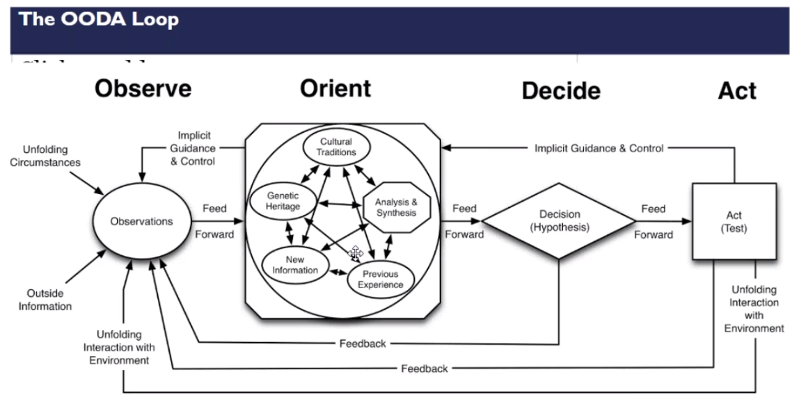
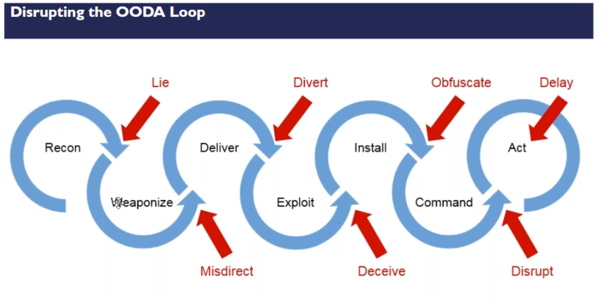

# BlackHills: Active Defense & Cyber Deception Training 4/9/20

This was a 4 hour training

<https://blackhillsinfosec.com/training/active-defense-cyber-deception-training/>


- [Background](#Background)
- [Cyber Deception](#Cyber-Deception)
- [Lab](#Detecting-Attacks-(Lab))

- [Check Out Later](#Check-Out-Later)
- [List of Obfuscation Techniques](#Obfuscation-Techniques)


## Background

#### Active Defense

- **Active Defense** - limited offensive action and counteracttacks to deny a contested area
- **Passive Defense**- Measures taken to reduce probbability of and to minimize the efefects of damage caused by hostile action without the intention of taking the initiative. Aka "Hope for the best"
- Prevent => Detect => Respond - *"Prevention is ideal, but detection is a must"*

#### Offensive Countermeasures

- offensive techniques as aggressors attack, but with a defensive posture
- Think poison, not venom
- Make sure you have a solid legal footing

### Cyber Deception

- Deliberate and calculated process of deceiving attackers in an effort to wage a better defense....make them work harder
- `Deception_time + Reaction_time < Attack_time`






#### Commerical Cyber Deception (HoneyPots)

- Javelin networks - bought by Symantec
- Cymeetria
- Illusive networks
- Attivo networks
- TrapX
- Acalvio


#### Warning Banners

- illegal to set up lethal traps for trespassers
  - Telnet banner court case ([Reddit](https://www.reddit.com/r/cyberlaws/comments/fxzr0r/cannot_seem_to_find_the_telnet_banner_story/))


#### Current Strategies aren't working

```bash
var curr=(Patch, strong passwords, AV, Firewalls and proxies, etc..)
var next-gen="Next-Gen${curr[@]}"
```


### Legal Cases

- Susan v Absolute - Violating Wire Taping Laws
  - IP and Geolocation are okay, even if it is stolen.
  - However, if you start taking pictures of the computer, going through internet history, etc.. this is **NOT** okay.
  - "Even bad people that steal computers have rights"
  - So don't do this [Defcon vid](https://www.youtube.com/watch?v=Jwpg-AwJ0Jc)
  - [Court Case Src](https://www.wired.com/2011/08/absolute-sued-for-spying/)
- Callbacks
  - Note illegal: Software Updates, Check License Keys, phone tracking,

#### Reality Check

- Hacking back is illegal ([Current Legislation that has NOT passed](https://www.cyberscoop.com/hack-back-bill-tom-graves-offensive-cybersecurity/))

- So instead, annoy, attribution, and attack (with warrant).
- "Hallmarks of Legality" (Ben somehting SANS instructor)
  - Discuss, document, plan, consult others
  - Do not hide - hidiing might be interpreted as what you knew/thought was wrong/illegal
  - Don't be evil

- Poison vs Venom
  - Poisin is the baddies getting hurt by touching your stuff
  - Venom is your stuff touching the baddies


## Detecting Attacks (Lab)

- Log on Windows
- HoneyPots should be monitored
- HoneyPorts (Go to Lab) -  as soon as an attacker accesses the port, it will block the attacker for any computer at all.
  - More info from [Legal But Frowned Upon](https://www.legalbutfrownedupon.com/honeyports/)
  - Blackhills [video on this topic](https://www.blackhillsinfosec.com/messing-with-portscans-with-honeyports-cyber-deception/)
  - nmap's syn scan won't trip it
  - Syn inital sequence number packet is 32 bits
    - Responds with syn ack - thanks Networking class
  - Don't set up on port already in use, make exceptions for vulnerability/red team's software
  - Many vendor products actually have this (E.g. Palo Alto)


- Use [CanaryTokens](https://canarytokens.org/generate)


## Check Out Later

- Go through labs later
- tcp wrappers // port spoofing
- (Word/Excel) Web Bugs and [CanaryTokens](https://blog.thinkst.com/p/canarytokensorg-quick-free-detection.html)
- Like Tor - <https://geti2p.net/en/>

- [DFIR CTF oldie but goodie](https://betweentwodfirns.blogspot.com/2017/11/dfir-ctf-precision-widgets-of-north.html)

- [Copy cat?](https://github.com/Cugu/awesome-forensics#ctfs)

- [CredDefense Toolkit to make attackers lives miserable](https://github.com/CredDefense/CredDefense)

- [Tarpitting on Layer 2](https://en.wikipedia.org/wiki/Tarpit_%28networking%29)

- [TrustedSec's Artillery Blue Team Tool](https://github.com/BinaryDefense/artillery)

  

#### Obfuscation Techniques

- base64
- sysmon bypass
- [Lol (leaving off the land) bins](https://lolbas-project.github.io/)
- https://github.com/iagox86/dnscat2
- https://github.com/danielbohannon/Invoke-Obfuscation
- https://github.com/trustedsec/unicorn
- https://github.com/CBHue/PyFuscation
- https://github.com/outflanknl/EvilClippy
- https://github.com/backlion/Offensive-Security-OSCP-Cheatsheets/blob/master/offensive-security/t1027-obfuscated-powershell-invocations.md
- gzip compression
- gcat
- [CLMBypass](https://gist.github.com/C0axx/6648e64892a1d4de7d397090d9514981)