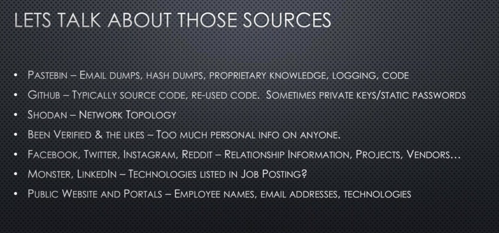

# Black Hills Webcast (2/13) -  OSINT

## Intro

Company info on the internet: Organization history, employees pii, leadership, technologies, security, partners/vendors/clients

- **Hr is your friend**: consider them the SME of the company’s social media
- [Grey literature - Wikipedia](https://en.wikipedia.org/wiki/Grey_literature)
- Exifdata of leaderships pictures 
- BeenVerified is great but costly
- How do osint tools , how do they parse data or just apis? APIs
- Create Google search alerts

## Cert transparency 

- **Purpose**: for enumeration
- SSLMate on GitHub -  _SSLMate/certspotter_
- DNSTwister tool

## Recon

- HackerTarget.com is online tools
  - Part of it: Dnsdumper is great for enumeration via api
- MXToolbox - mail loops, does anything go down or up?
  - has api
- url crazy - does typo squatting well
- monster, Glassdoor, etc 
- Facebook, twitter, instagram, vin numbers on carmax, reddit
  - Hashtags: #ciscosystems, #nicebadge, #workplace
- Hunter.io for email addresses
  - has api calls
- haveibeenpwnd.com with domain monitoring
- [Re-active SPF Auto-Recon](github.com/Relkci/AutoSPFRecon)
  - sending emails not from internal domain
  - [Offensive SPF: How to Automate Anti-Phishing Reconnaissance Using Sender Policy Framework - Black Hills Information Security](https://www.blackhillsinfosec.com/offensive-spf-how-to-automate-anti-phishing-reconnaissance-using-sender-policy-framework/)
  - DMARC forensic report

- Grayhatwarefare - allows you to search Amazon S3 Buckets
- LinkedINT and Peasant
  - point Peasant to cookie file
- [Suggested Twitter scraper](github.com/twintproject/twint)

## Questions

- Is there a tool recommended to amalgamate all OSINT information into easily viewable profiles/relation trees? Preferably FOSS. **Spiderfoot**!
