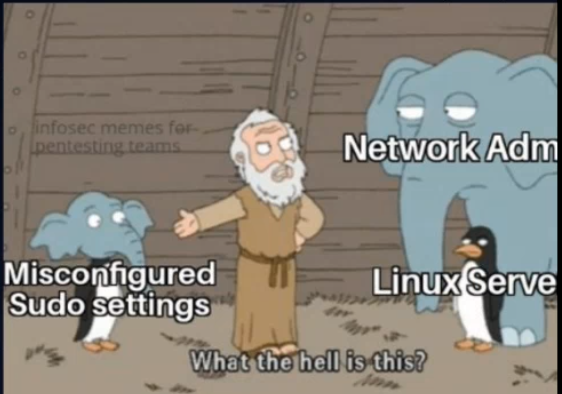
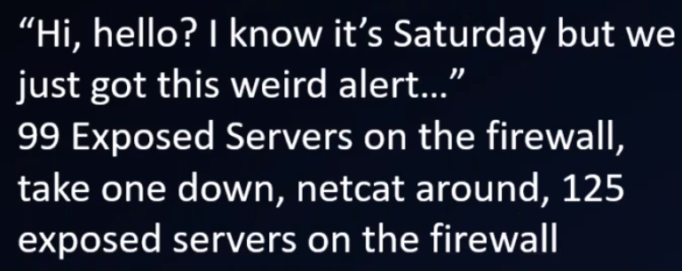

# Magnet Forensics: The Art of Juggling: IR Circus Tricks for the Overwhelmed 5/21/20

Presenters: Shelly Giesbrecht from CrowdStrike @nerdiosity and Heather @LitMoose

## Summary

1. [Practical Tricks](#Part-1:-Practical-Tricks)
2. [Technical (not really) Tricks](#Part-2:-Technical-Tricks)

Fun Fact: A **roustabout** sets up the show the same way each time.

## Part 1: Practical Tricks

- Don't repeat tasks without automation
- Who/how/when needs to be notified each time? (Having specific the comm mediums)
- Good IR project leads make sure they never repeat work unnecessarily.

- Know your audience, especially in the report.
  - ([Active](https://en.wikipedia.org/wiki/Active_listening)) Listen to what their needs are. 
    - Understand when they're calling you they are not in their normal frame-of-mind (aka kind, respectful)
  - Still, be flexible
  - **Pause**. Take deliberate pauses to make sure everyone understands what's going on (especially on status update calls)
- **Step 1: Establish Objectives**
- Don't let surprises occur. Always know what's coming up next and pivot if need be. Explain and be realistic about client expectations. 
- Knowing the best person(s) for a particular task is a key to success.

## Part 2: Technical Tricks

- Have a 'set list' for each audience
  - Win vs Linux vs Mac
  - Ransomware - encrypt vs exfil
  - "What's your objective? What are you most worried about?"
  - "Did anything get taken?"
    - "We're just gonna rebuild our environment anyways."
- The Google Script
  - "What's the first thing you notice?" Then Google symptoms and check out PoC of Vuln.
- Staging tasks, prioritize, and delegate
- Multiple forms of evidence
- Have the right props for the evidence:
  - [Sharphound/Bloodhound for Active Directory](Sharphound/Bloodhound for Active Directory)
  - Axiom for Full Disk
  - [Splunk](https://github.com/jklm264/My-Forensics-Notes/blob/master/Tools/splunk/SuggestedSearches.md) or GrayLog for large volume log parsing
- *Don't release the doves too early*
  - Threat actors might still be in the environment
  - Don't revert images/reimage until you have everything you can get
  - Plug, Network segmentation
- Code names save face
