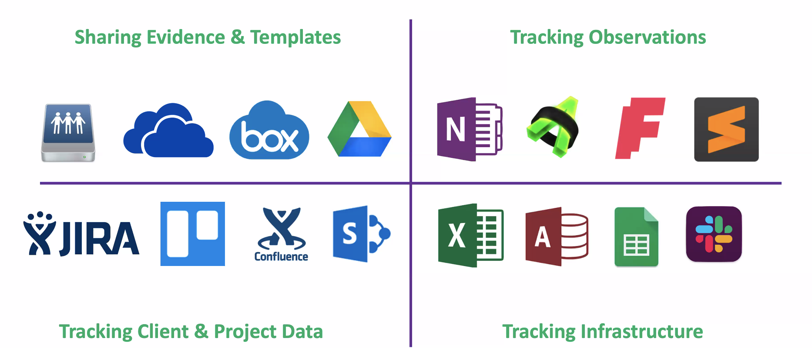
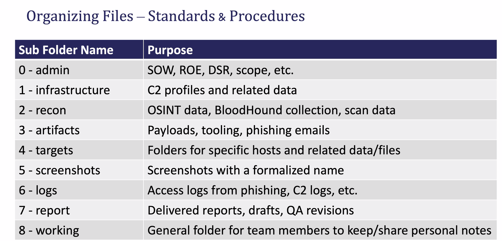
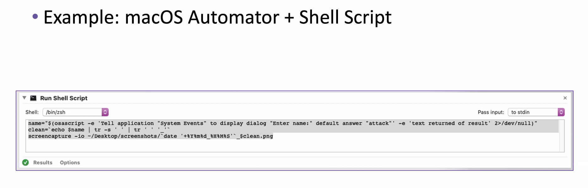
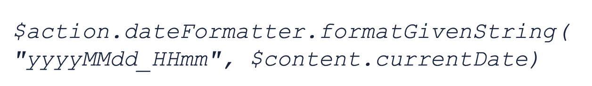
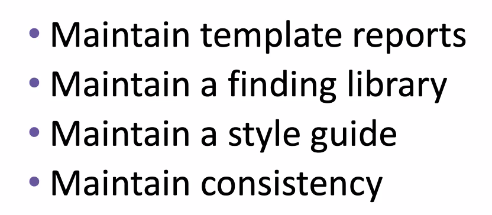
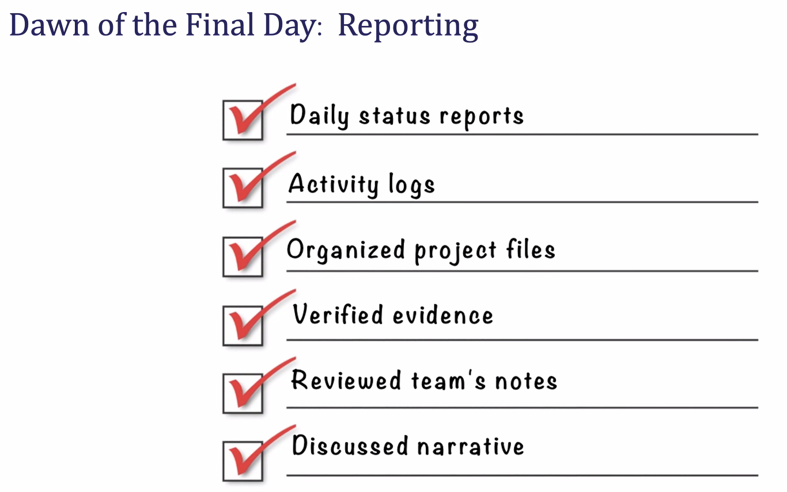

# SpecterOps:Remote Team Project Management and Reporting Construction 4/10/20

Chris Maddalena (@cmaddalena) - advesary simulation 

- [Chris's Github Link](https://github.com/ChrisMaddalena)
  - [Red Team Cheat Sheets](https://github.com/chrismaddalena/RedTeamMemory/blob/master/Mimikatz.md)
- [Check Out Later](#Check-Out-Later)

### Building blocks for success

- naming conventions

### Remote team management

- micromanaging is better
- set clear expectations

### Daily communication

- daily stand-up calls
- EoD status reports (can be emails)

### Real Time Communication

- create a routine - people like end times 
- embrace conversation with ALL team members

### Communicate Expectations

- concrete and written
- Topics:
  - working hours/execution hours
  - know when colleges are working during certain hours
  - what are employees are allowed to do without approval // whats the grey line

### Organize Files

- think outside yourself

- organize as a team, not invidual

- naming convention for everything (screenshots, logs, etc)

  - based of screenshot software -- change default naming conventions

  - Ex: 

    

- Can automate this

### Managing Infrastructure

- must be consistent
- commit to style *as a team*
- should automate a solution becaue people forget
  - cloud asset monitoring with APIs
  - forgetting to teardown servers/containers which could cause risk later on
- [Ghostwritter](https://posts.specterops.io/introducing-ghostwriter-part-1-61e7bd014aff) tool
- Or even simple script that when checked 'done' send an email to project members to remind to delete/tear-down everything

### Activity Logs

- Log in everything - tmux too but with perspective might not be enough
- Need to log the command run then why you did it and what you wanted to accomplish with it
- Log anything that would trigger an alert too
- Define a standard and start logging immediately
- Things that should be logged: times (UTC), source, target, tool ,user content (dir), cmd, description, result, comments, system mod?, operator (who did it)

#### Automation

- use built-in features
- start small with timestamps

- confluence macros - autofill in timestamp

  

### Reporting with style (Style guide)

- what acronyms are needed to explain and which can be left out
- What words are capitalized
- Bishop fox cybersecurity style guide

### Check your work

- implement QA
  - removes bias
  - catch mistakes

### Summary

## Check Out Later

- [Bishop Fox's Cyber Style Guide](https://know.bishopfox.com/hubfs/mkt-collateral/Bishop-Fox-Cybersecurity-Style-Guide-V1-1.pdf)
- [Ghostwritter tool](https://github.com/GhostManager/Ghostwriter)

