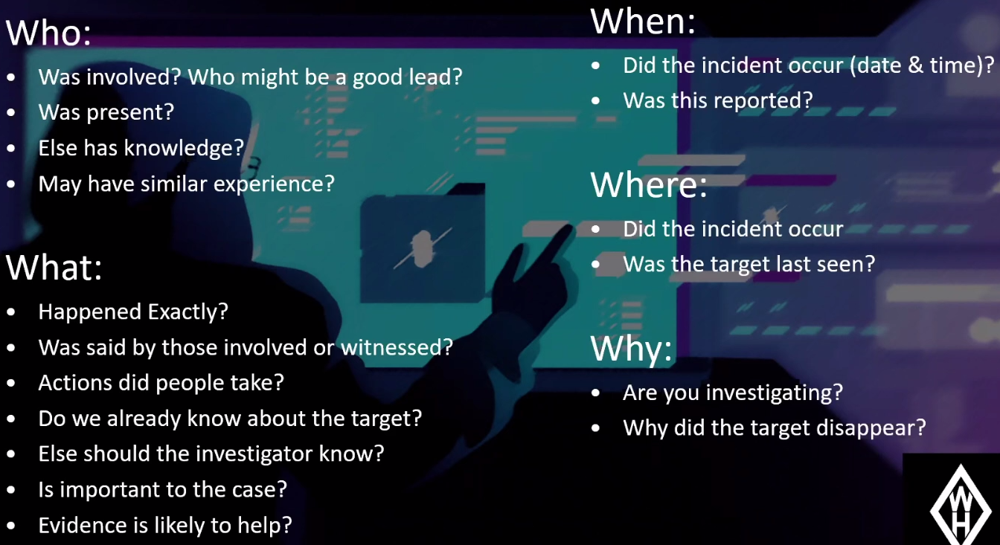

# WomenHackerz: OSINT For Missing People Workshop 6/7/20

Presenters: @thecyberviking @alantheblank @rag_sec @AlanTheBlank

- [Check Out Later](#Check-Out-Later)

## Rules of engagement

- 'No touch' rule - Interacting is considered tampering with evidence

  - definitely no password resets

- No breaking accounts

- Be like a ghost - sock acts, fresh vm's, vpns, ect.

- Good OPSEC

  

- Signed permission is key

  - don't speculate - - or you'll build a bias

## Process workflow

- then spider from there

- http://mullvad.net/en/
- winscribe vpn

- job listings and GitHub
- operation linkage aka corroborating artifacts
- searching landmarks in pictures

### Pivoting using Social Media

- Username searching

## Mindset

"Every piece of data is a clue"

- Pic reuse
- Friends/family circle
- What can I learn from their images/videos
  - Backgrounds
  - exif
- See targets mental state
- Public records
- A person's characteristics
  - Tattoos/scars
  - piercings
  - glasses
  - habits like smoking
  - gait
  - language patterns (verbal or online)

## Case studies

## OPSEC using OSINT in defense

- you can't protect what you don't know

## Tools, resources, and techniques

- [Their recommended spreadsheet](https://docs.google.com/spreadsheets/d/1JxBbMt4JvGr--G0Pkl3jP9VDTBunR2uD3_faZXDvhxc/edit#gid=970216593)
- Kali with Instalooter and Sherlock Project

- Google Dorking
  - Intext:, Inurl, Filetype,

- http://osirtbrowser.com/
- Only paid tool suggested: https://www.hunch.ly/
- https://intelx.io/ - search engine

## Check Out Later

- #osintforgood, #osint on twitter
- [TheCyberViking Stego Paper](https://github.com/TheCyberViking/CollegeResearch/blob/master/Counter-Terrorism in Steganography/readme.md)

- sourcing.games
- https://marcelle.ctfd.io/wsc-womenhackerz-ctf4noobz