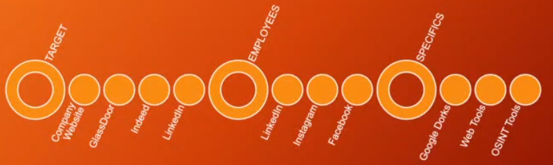
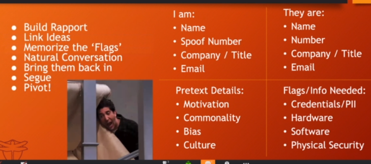

# WomenHackerz:OSINT for Social Engineering: A Phishy Little Liars Workshop 6/7/20

Presenter: Alethe Denis @alethedenis

- https://Tracelabs.org

## First Off

- write your morals out
  - most of the time you have to hold yourself accountable since no one else is really looking over your shoulder

## Example

`******************.com`

- scroll to bottom
- about us
  - looking for direct numbers, email addresses, charitable donations, official social media links
- People
  - Gives us an idea of brand, culture, how they want to appear in media
  - "What does the company want us to see?"
  - Google Dorks: `filetype:pdf` for sensative details
- Tool: ZoomInfo

## Building Pretext

- Limit amount of details, don't "verbal vomit'

  

- What you could look for:
  - new hire handbook
- Corporate Review websites
  - GlassDoor, Indeed
  - Great Place To Work, CareeerBliss, Vault, The Job Crowd, Kununu
- Website Photos
  - Hardware: Phone, monitor type, etc
  - Employee badges
  - Internal Building Layout
  - Naming conventions for conference rooms
- Charities that they're involved in
- Job postings
- PR, Media, and Social
  - LinkedIn - recruiter
  - Geotagged Instagram pictures
    - Search -> Places

- Discover vendor companies
  - Cafeteria, Party Vendors, Garbage Service, IT Consultant, Security provider, cleaning service, etc.

