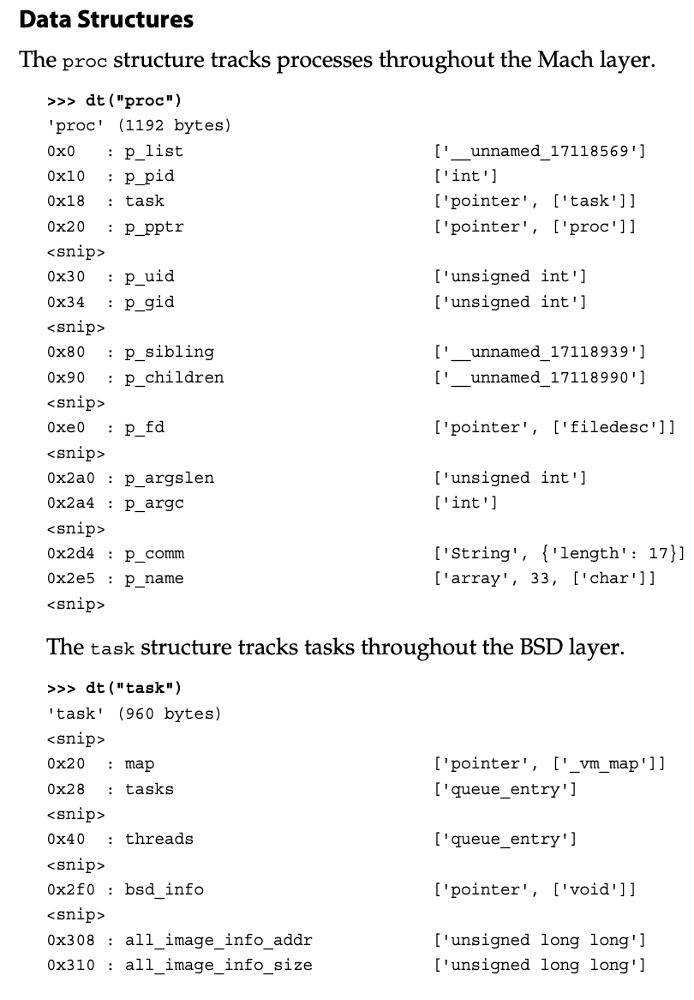
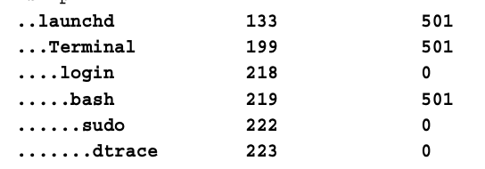

# Art of Memory Forensics Notes

## Sys Internals

1. _Mach layer_ is the OS X implementation of microkernel (from CMU) responsile for Virt MemMgmt, proc scheduling (like MS' csrss.exe), & message passing (XPC).

2. _BSD layer_ was for networking, fs interaction, POSIX compliance, and more.

**Note:** Before 10.5 (Leopard), Macs never split kernel & userland address space per process (each context had their own 32-bit (4GB) AS). So special buffers were used to read/write proc memory. Now (10.6 and on) they follow the 2GB/2GB or 3:1 kernel/userland split. 

Starting 10.8 (Mountain Lion), _kernel_ ASLR was used in virt AS. Make's finding env vars and functions harder for Vol.py. The workaround is to determine the ASLR "slide". the offset of where the variables are in memory versus the offset specified in the profile. It computes and applies this slide value to addresses queried from the profile.

- This works to find the string ("System Verification Code") `Catfish \x00 \x00` which is the beginning of the `lowGlo`structure. 
- Use `mac_find_aslr_shift` plugin whose value can be added to `--shift` option to speed up the scanning.
- Ex: `vol.py -f image.img --shift $(vol.py -f image.img mac_find_aslr_shift) mac_pslist`

## Memory Acquisition

Need a kernel module to access data (Which? KERNEL_MODULE_HERE)

- Safe acquisition of RAM can be done by finding where RAM is
  mapped within the system's physical address space.
- Tools to use: OSXPmem, Mac Memory Reader, and Mac Memoryze (closed src).
	- Done by parsing kernel's boot args (see _EfiMemoryRange_ struct in physical memory map)
	- Recall, acqusition tools only acquire RAM to avoid HW issues and system crashes.

**WARNING** " you have to assume that there is a very high potential for the acquisition software to affect the stability of the system or have unexpected results."

### To get most current profiles: 

- `curl -o MacProfiles.zip http://downloads.volatilityfoundation.org/MacProfiles.zip`
- `unzip MacProfiles.zip`
- `cp [Profile_Choice].zip  ~/volatility/volatility/plugins/overlays/mac`
- To check: ` python vol.py --info | grep Mac`

## Mach-O File Format (header)

- Magic Bytes: 0xfeedface (32-bit) and 0xfeedfacf (64-bit)
- CPU Type
- File Type: MH_EXECUTE (0x2), MH_DYLIB (0x6) aka shared libraries, MH_BUDLE (0x8), and MH_DYSM (0xa) aka debug files (think Windows PDB files) 
- Number and Size of commands

File segments: __TEXT, __DATA, __LINKEDIT (symbol and string table), and __IMPORT (symbols imported by other apps & libs).

## Proc Analysis

Enumerate procs with `mac_psxview`. But can also do granular view with pslist, parents, pidhash, pgroup, sleads (shows session leader proc of each session), tasks

- False indicators in `mac_psxview` don't always mean bad stuff is happening.

## Proc Relationships

Use `mac_pstree`.

See here how we can tell `$sudo dtrace` was ran from the terminal. Also note how the `kernel_task` proc is equivalent to Windows' `System` proc.

## Networking

Use `mac_netstat` to report which proc started the connection, `mac_network_conns` to find all network connections regardless of who started it.

- **apsd** is a TCP application running on 5223 which is Apple's
  push notification service daemon.

## SLAB Allocator

- (de)allocates memory structures specifically related to proc and thread creation, fs interaction, network activity, and IPC (aka XPC).
- Keeps track of previously freed objects!
- Use `mac_dead_procs` to view recently freed elements within the _proc_ zone.
	- Seems easy enough to create other _dead_ plugins for udpcb, tcpcb, tasks, etc.

## Recovering Files from Memory

- Each file has a **vnode**. To list files use `mac_list_files` and `mac_dump_file`
	- See page 812 for details.
	- E.g. To see user database directly from the memory:
		- `mac_list_files` and get Offset of
		  /etc/master.passwd file
		- `mac_dump_file -q [OFFSET] -O [Output_file_name]` 
- **OR** can use `mac_recover_filesystem` pluging to recover the full file system structure (+ metadata). Internally, this is done by finding mount points with `mac_mount` then mount.mnt_vnodelist's linked-list is walked to enumerate the rest of the files.

## Misc

- `mac_psaux`: Recovers the command-line arguments of a process, which is useful to determine which configuration flags were passed to an application.
- `mac_lsof`: Lists the open file descriptors of a process. Its output is formatted exactly like linux_lsof, in which the file descriptor number is listed along with the full path on disk for each file. 
- `mac_mount`: Provides information similar to linux_mount. For each mounted file system, the physical device, mount point, and file system type is listed.
- `mac_list_sessions`: Lists each login session along with the user that started the session and the session leader process.
- `mac_ifconfig`: This plugin is similar to linux_ifconfig and it lists the name and IP address of each network interface.
- `mac_dmesg`: Dumps the kernel debug buffer. Its Linux counterpart is linux_dmesg.
- `mac_route`: Lists the kernel’s routing table like its Linux counterpart linux_route.
- `mac_arp`: Lists the kernel’s ARP cache like its Linux counterpart linux_arp. 
- `mac_bash`: Recovers the commands entered into the bash shell.
- `mac_bash_hash`: Recovers the command alias hash table.
- `mac_bash_env`: Recovers the environment variables of the bash session.

## Live Forensics

- See page 820 and 821 for commands and remarks.
