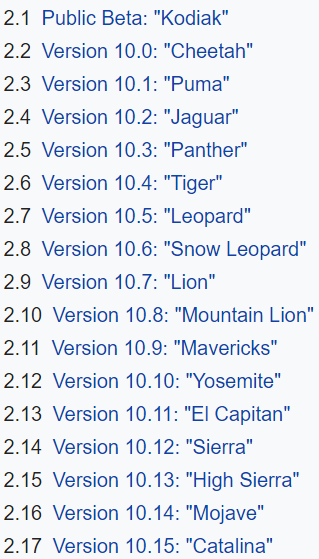

# TLDR
**At the moment, I cannot find any FORENSIC acqusition tools which work on Mojave, or Catalina**
	* Take another look at [GRR](https://github.com/google/grr) and [osquery](https://github.com/osquery/osquery)
* The trusted tools are OSXpmem and [Macquisition(paid)](https://www.blackbagtech.com/products/macquisition/) for acquisition

# OSX vs MacOS Difference
If you want to get technical, the answer is [yes](https://www.quora.com/Are-there-differences-between-macOS-and-OS-X):

* macOS describes the Apple operating system designed to run on Apple laptop and desktop computers starting with version numbers 10.12 and later.
* OS X describes the Apple operating system designed to run on Apple laptop and desktop computers starting with version number 10.8 through 10.11.

# Acquisition Tools
See [here](Acquisition_Tools.md)
	
# Active Development
* [Mac_apt](https://github.com/ydkhatri/mac_apt) 
	* *"So far, we've tested this on OSX 10.9 (Mavericks) through 10.14 (Mojave)."* - [Src](https://github.com/ydkhatri/mac_apt/wiki)
* [OSquery](https://github.com/osquery/osquery)
* [Plisteditpro](https://www.fatcatsoftware.com/plisteditpro/) 
* [Any tool from Jonathan Levin's site](newosxbook.com/tools)
* [otool (@Apple)](https://www.unix.com/man-page/osx/1/otool/)
* [jtool (@JLev)](http://www.newosxbook.com/tools/jtool.html)
* [Black Light](https://www.blackbagtech.com/products/blacklight/) -- Great tool but very expensive
* [X-Ways](https://www.x-ways.net/) -- Not free
* [OS X Collector - github!](https://github.com/Yelp/osxcollector)

# List of Forensics tools no longer being maintained for OSX
* Volatility
* osxpmem - https://groups.google.com/forum/#!topic/rekall-discuss/fUvzOERzQMw
* Rekall (@Google)  
* MacFUSE (@Google) - https://code.google.com/archive/p/macfuse/
* Mac Memory Reader - Download site is offline
	* https://digital-forensics.sans.org/blog/2011/01/28/mac-os-forensics-howto-simple-ram-acquisition-analysis-mac-memory-reader-part-1
* otool [https://github.com/gdbinit/otool-ng]

# Community Forums
* BlackBag - need to be paid member
* Reddit: [r/osx](https://www.reddit.com/r/osx/), [r/dfir](https://www.reddit.com/r/dfir/), [r/Computer Forensics](https://www.reddit.com/r/computerforensics/)
* www.dfir.training

# Everyday Tools
See [here](everyday_tools.md)

# Mac Internals
See [here](MacInternals.md)

# Misc Links
See [here](miscLinks.md)
