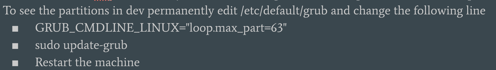

# Thoughts and notes on all things forensics!

* Tools
	* [Volatility Link](https://github.com/jklm264/My-Forensics-Notes/tree/master/Tools/Volatility_learning "Volatility")
	* [Rekall Link](https://github.com/jklm264/My-Forensics-Notes/tree/master/Tools/Rekall_learning "Google's Rekall + GRR + some Memory Forensics notes")
	* [Angr Link](https://github.com/jklm264/My-Forensics-Notes/tree/master/Tools/angr "Angr")
* Windows Forensics

