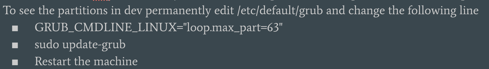

# Thoughts and notes on all things forensics!

- [Windows Forensics](Windows_Forensics)
- [Apple Forensics](Apple_Forensics)
- [Cloud Forensics](Cloud_Forensics)
- [OSINT Forensics](OSINT_Forensics)
- [Tools](Tools/)
  - [Angr](Tools/angr "Angr")
  - [Autopsy](Tools/autopsy)
  - [Elasticsearch](Tools/elasticsearch)
  - [RegRipper](Tools/regripper/regripper.md)
  - [Rekall](Tools/Rekall_learning "Google's Rekall + GRR + some Memory Forensics notes")
  - [Splunk](Tools/splunk)
  - [Volatility](Tools/Volatility_learning "Volatility")
  - [KAPE](Tools/kape)

---
[Copy/Paste Presentation Outline (md)](presentation_skeleton.txt)

[This Youtube Playlist](https://www.youtube.com/playlist?list=PLlY54XJEpOzyj8Dvqu8e78AcH6s5ZKmZM)

