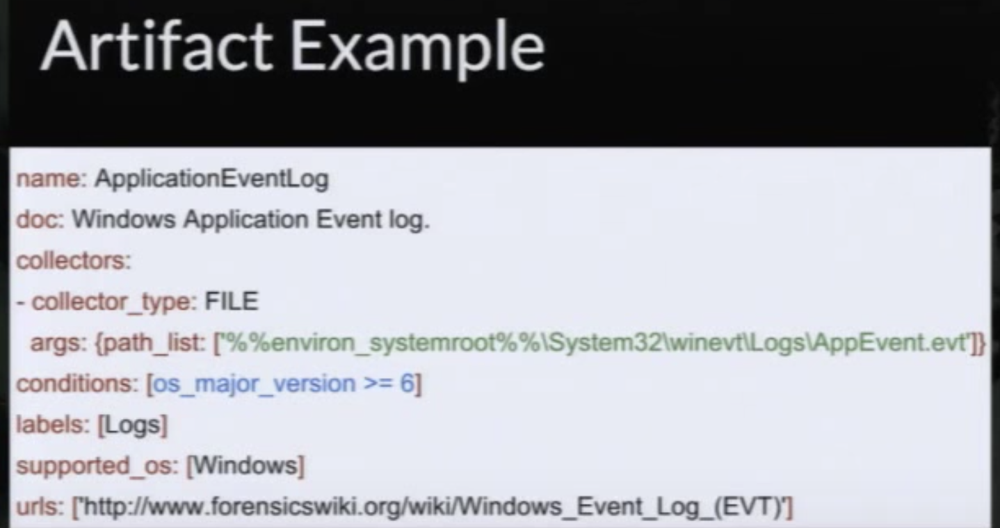

* Rekall is owned by Google, while Volatility is FOSS and maintained by the Volatility Foundation.

* One of the main differences between Rekall and other memory analysis frameworks is that Rekall uses symbols obtained from operating system vendors’ debugging information directly. 

  > ...Rekall is the only memory analysis platform specifically designed to run on the same platform it is analyzing: Live analysis allows us to corroborate memory artifacts with results obbtained through system APIs, as well as quickly triage a system without having to write out and manage large memory images...

  > ...(For example Rekall features the only memory imaging tool available for recent versions of OS X, that we know of - and it is open source and free as well!).

* Rekall is built on top of Grr database. Grr is allows for IR to be done in fast, scalable manner to allow analysts to quickly triage attacks and perform analysis remotely. Grr's database is built as a YAML-typed git repo. See `Artifact Example.png` for example. ([Src](https://grr-doc.readthedocs.io/en/v3.2.1/what-is-grr.html))

# How to Install Rekall

1. `virtualenv  /tmp/MyEnv`
2. `$source /tmp/MyEnv/bin/activate`
3. `$pip install --upgrade setuptools pip wheel # one part will fail, dw`
   1. Future dependency issue ([Src](<https://github.com/google/rekall/issues/448)): `$sudo /tmp/MyEnv/bin/pip install future==0.16.0`

4. `$pip install rekall-agent rekall`
5. (Deactivate) to leave

## Live Memory Inspection

[See Here](Rekall_LiveMemInspect.md)

## Example Artifact

## Resources

- <https://holdmybeersecurity.com/2017/07/29/rekall-memory-analysis-framework-for-windows-linux-and-mac-osx/>
- <http://memory-analysis.rekall-forensic.com/www/02-What_is_memory/>
- <https://github.com/ForensicArtifacts/artifacts/blob/master/docs/Artifacts%20definition%20format%20and%20style%20guide.asciidoc>
