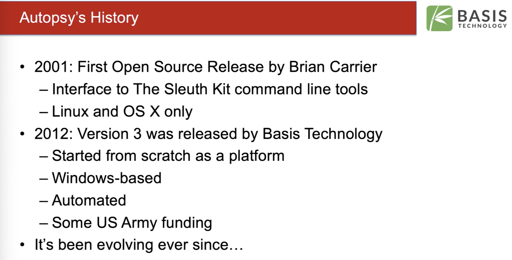
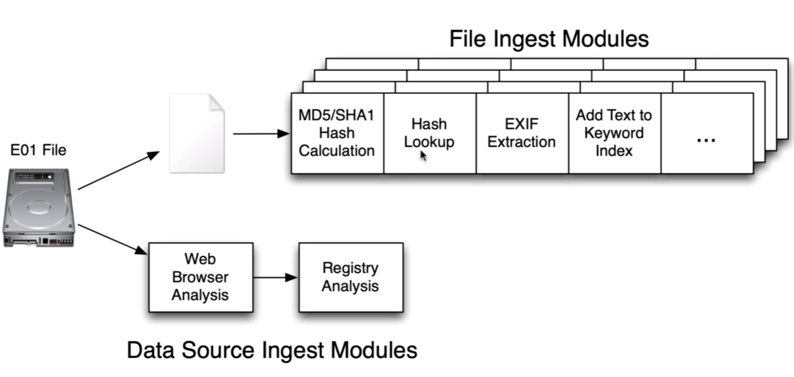
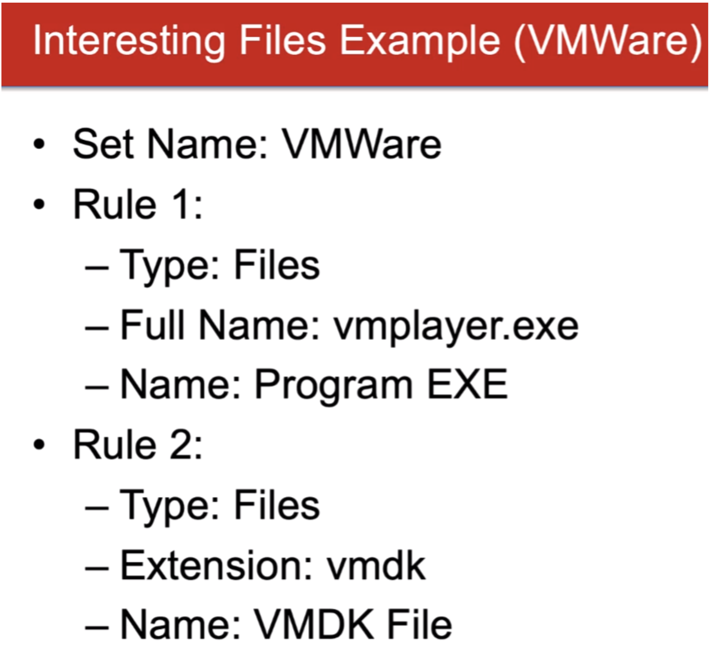
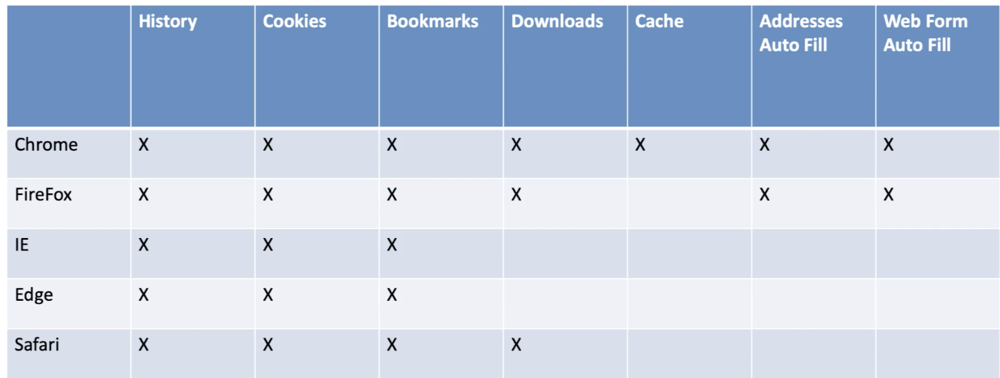
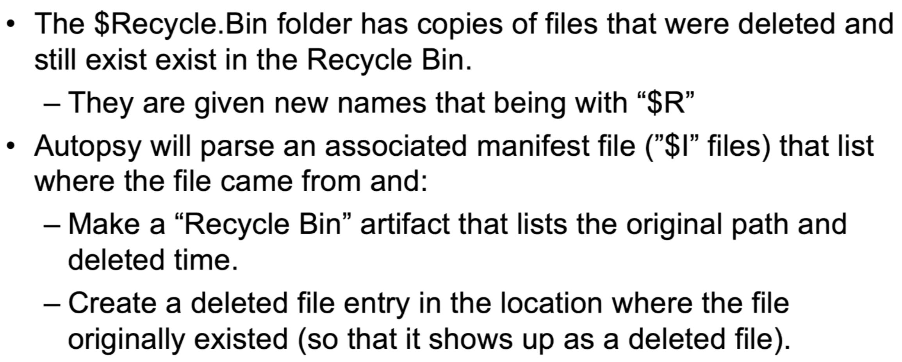
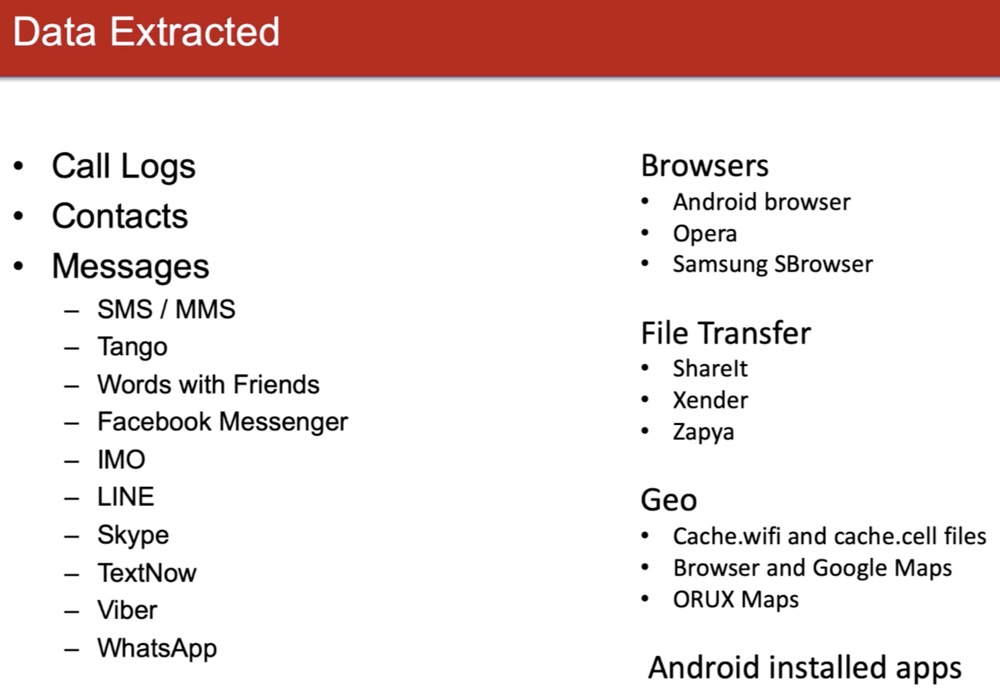
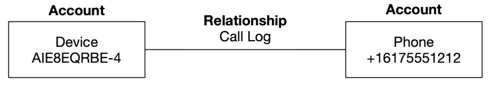

# COVID-19 Free Autopsy Training

Renzik is the name of the doggo in the logo

### ToC

1. [Introduction](#1.-Intro)
2. [Overview](#2.-Overview)
3. [Cases and Data Sources](#3.-Cases-and-Data-Sources)
4. [UI](#4.-UI-basics)
5. [Analyzing the Data Sources](#5.-Analyzing-the-Data-Sources)
6. [Hash Lookup Module](#6.-Hash-Lookup-Module)
7. [Simple Modules (fileID, extension mismatch, exif, Embedded File Extractor, email, interesting files, Encryption Detection Module, Plaso, VM Extractor Module, Data Source Integrity ](#7.-The-"Simple"-Modules)
8. [Recent Activity Modules](#8.-Recent-Activity-Modules)
9. [Keywords Search Module](#9.-Keywords-Search-Module)
10. [Correlation Engine Module](#10.-Correlation-Engine-Module)
11. [Android Analyzer Module](#11.-Android-Analyzer-Module)
12. [Timeline Analysis](#12.-Timeline-Analysis)
13. [Image Gallery](#13.-Image-Gallery)
14. [Communications Interface](#14.-Communications-Interface)
15. [Tagging, Commenting, and Reporting](#15.-Tagging,-Commenting,-and-Reporting)
16. [Installing 3rd party modules](#16.-Installing-3rd-party-modules)

## 1. Intro

-  v3 was financially backed by the US Army
- Came out of OSDFcon since no tool solves all problems (while being extensible)

- Basis Technology is primary devs of Autopsy led by Brian Carrier

## 2. Overview

1. **Single-User Deployment**

2. **Multi-User Deployment**
   - "Auto Ingest" mode
   - Cases can be opened bby multiple users at the same time
   - 2 Dedicated servers (PostgreSQL with ActiveMQ AND Solr) and a central NAS storage

**Central Repository** - Database that stores data from past cases

- Case-specific databases
- "Other Occurences" shows you if a file was seen in a past case
- Centralizes notable hash sets
- Can be deployed as SQLite but can be used by only one user at a time.
- Can also be deployed as PostgreSQL stored on a server for multi-user cases

### Other Configurations

- Machine Translations
- Add a hash set
- Add a keyword list

Mainly developed for Windows; can be run on Linux/Mac though.

## 3. Cases and Data Sources

Case - groups the investigation data together

- Should group *by investigation* and/or *by host within an investigation*
- Note: reporting is done at a case-level

- Has a base directory

Files created include:

- Autopsy.db - stores basic case info and data source info
- Exports dir
- Reports dir
- ModuleOutput dir

### Data Sources

- Disk images - can take raw, E01, raw phone images, vm formats
  - will not validate E01 files directly on import
  - will analyze with The Sleuth Kit (TSK)
    - Volume analysis support: DOS, GPT, Mac, BSD, and more
      - If no volume is found, entire image is analyzed as a file system (e.g. Flash media)
    - File System analysis support: NTFS, \*Fat\*, HFS+, IOS9660, etc
    - Orphan Files analysis - files that no longer has a parent folder. [Very time intensive, can be disabled]
    - File analysis (carving) with PhotoRec [aka TestDisk] will be under "$CarvedFiles". This is done during the ingest modules
    - "$Unalloc folder" for unallocated space. Files named `Unalloc_ParentID_StartByte_EndByte`
  - Limitations: No RAID, Logical Volume Mangement, or BitLocker
- local drives - C: or E: drives
  - Use-Case: Running Autopsy from USB or external media (write-blocker)
  - Same process as disk image
  - Need to run as admin to access all drives
  - 'sparse VHD' image for triage situations. This tells you if Autopsy has seen this part of the drive before. With enough time it will create a full image of the drive(s) just analyzed
- local files (aka logical files/folders) - stored on a computers FS
  - **Note**: Times are ignored so timestamps will have zeros.
  - Files are not copied or moved
  - Can use "Logical Evidence File" type (L01) aka the output from autopsy logical imager
- unallocated space files (raw)
- For now, Autopsy does not analyze, just scans to begin populating folders and databases. Analysis comes in another phase.

### What gets stored in the database

- File metadata - name, mac times, size, md5, etc
- Partition layouts
- Does NOT have copies of file content

### Lab Questions

1. Open the “Data Sources” part of the left-hand tree (we’ll cover this tree more in the next section). 

   1. **Question**: How many volumes does the disk image have? 6
   2. **Question**: What is the name of the unallocated space file in vol1? Unalloc_3_0_1048576
   3. **Question**: Right click on vol7 and choose “File System Details”.  What file system is in vol7?  NTFS

2. In Windows, open “C:\case1” in a file explorer and observe its contents. 

   1. **Question**: What is the database called? autopsy

   2. **Question**: Roughly how big is the database (in megabytes)? 230.4 mb == 230400 kb

      

## 4. UI basics

- The Tree= [data sources, views, results, tags, reports]
  - organized bby drive layout
- Can merge data if you don't care (if analyzing two devices owned by the same person) which device went to a certain website, or opened a video

### Table Icons

- Score
  - Red Exclamation Point - means file is notable
  - Yellow upside-down triangle - item is suspicious if module, or self, has marked it
- Comment
  - Yellow Notepad - the file has a comment
- Occurrences Integer - how often this item has been seen in past cases (requires a CR)

**Ingest Inbox** -  "sends" you a message when autopsy thinks it's found something valid

### Lab Questions

Keep the same case open that you created in the last section.  Let’s look at the data in the tree.

1. Question: By extension, how many databases are there? 59
2. Question: What is the size of the largest database? 5242880
3. Question: Are there any databases by MIME type yet? No
4. Question: What are the names of the files between 200MB and 1GB in size? \$BadClus:$Bad, Winre.wim, chrome.7z

## 5. Analyzing the Data Sources

Ingest Modules - responsible for analyzing the data

- Via hashing, keyword searching, etc

- Types: 

  1. File Ingest Modules - Run on everyfile unless 'Ingest Filter' is applied (for triage). Can run in parallel

     - Uses **Ingest Manager** to do file prioritization 

     - 1. User Folders 2. Program Files and other root folders 3. Windows folder 4. Unallocated space

  2. Data Source Ingest Modules

     - Better for focused analysis techniques
       - [The File Ingest Module](https://www.autopsy.com/python-autopsy-module-tutorial-1-the-file-ingest-module/) and [The Data Source Ingest Module](https://www.autopsy.com/python-autopsy-module-tutorial-2-the-data-source-ingest-module/) and [Main Ingest how-to docs](https://www.sleuthkit.org/autopsy/docs/api-docs/4.1/mod_ingest_page.html)

- Autoposy comes with hash lookup, keyword search, embedded file extraction, recent activity, email

- **Blackboard Artifact** (type, value)
  - Ingest modules will save thier results in these
  - Ex: Web Bookmark, hash hit, encryption detected, USB Device Ids, exif data, etc
  - Can be seen in Results -> Extracted Content in tree

### 6. Hash Lookup Module

#####What does it do?

1. Calculates MD5 hash
   - Skip unallocated space files
2. Stores hash in case db
3. Looks up hash in hash set
   - Look up in all configured hash sets
   - Supported hash sets
     - NIST NSRL - flag as 'KNOWN'
     - EnCase
     - TSK SQLite format (`.kdb`)
     - md5sum
     - Hashkeeper
4. Mark file as: Known (NSRL) OR Known bad/Notable
   - Known Statuses
     - Notable/Known Bad
     - Known - seen before
     - Unknown - default

##### Why?

- include hash in report for Chain of Custody purposes
- ingest faster and skip known files using NSRL
- hide known files in UI
- identify notable files (ex: Child exploitation pics that law enforcement share with one another)
- Keep central repo up to date and correlate with past cases

**NSRL**  - Part of standard, normal applications and do not need to be analyzed based off hashes ([Src](https://www.osforensics.com/faqs-and-tutorials/import-nsrl-hashsets-from-nist.html))

Most hash sets aren't sorted, so Autopsy will make an **index** (`.idx`) that binary sorts them. Index file can be  shared, or consider using a remote hash set.

- Use Autopsy's NSRL to index it becaue most MS computer's can't handle the sheer volume of hashes.
  - [Download Pre-Indexed NSRL from Sourceforge](https://sourceforge.net/projects/autopsy/files/NSRL/NSRL-266m-computer-Autopsy.zip/download)
- In report module, this will add found hashes to final report

##### Analysis Shortcut

A good starting place for investigations is to look in and around known files:

1. Those known files are contraband
2. These are clues to start looking around

**Then** Right-Click to 'View file in directory' to see parent folder that this file is in

#### Lab Questions

1. **Question**: Let ingest get at least 15% through the drive.  How many total hits are found under the “Hashset Hits” results after running the Hash Lookup Ingest Module? 6
2. **Question**: What are the filenames of the hash hits?  RN.jpg, f_000239 (cache file)
3. **Question**: How many total ".jpg" files are in the folder “Pictures” where the notable hash hit was found?  7

### 7. The "Simple" Modules

#### File Type ID

- Determines file type based on signatures (magic numbers)
- Uses Tika open source (not magic_lib)
- Reports as MIME-type: 'application/zip', '/audio/mpeg', 'image/jpeg'
  - **Note:** 'application/octet-steam' means unknown type

#### Extension Mismatch

- Detect hidden files
- Must configure: file types on focus, skip known file types, list extensions for each file type
- Reduce false-positives by *'Check only multimedia and executable files'*

#### Exif

- Extracts Exif from JPEGs
- Can Geo-cooredinate pics if applicable

#### Embedded File Extractor

- extracts embedded files so they can be analyzed
- Ex: zip, rar, office docs, pdf's, etc
- flagged if password protected
- these are saved inside the case folder

#### Email

- Searches for MBOX, PST, and EML files
- adds email artifact to blackboard
- Groups emails and attachments into threads

#### Interesting Files

- Interesting file types, file names, and paths/parent-dirs 
- Automates investigators checklist (iphone backups, vmware images, bitcoin wallets, cloud storage clients)

#### Encryption Detection Module

- Flags files and volumes by password and/or high entropy, mulltiple of 512 bytes, and no known file type

#### Plaso Module

- parse logs and file types to extract time stamps
- some time stamps will duplicate what Autopsy already extracts
- Log2timeline equivalent

#### VM Extractor Module

- Analyze virtual machines found in a data source
- Detects vmdk and vhdi, makes local copy, then feeds them back in as data sources

#### Data Source Integrity Module

- Validates and calculates hash of disk since Autopsy does not do this
- Retrieves hash from E01 or from what user entered when data source was added
- Calculates and makes an alert if different
- Will also save hash if one was not entered at beginning 

##### Lab Questions

1. Question: Under the “Exif Metadata results, how many photos were taken with the following devices?
   1. iPhone 7 Plus? 1
   2. Samsung Galaxy S8? 0
   3. BLU R1 HD? 15
2. **Question**: What is the MIME type listed for the file “D3D11_Default.shader-db.bin”? application/octet-stream
3. **Question**: What is the file size for the file “D3D11_Default.shader-db.bin”?” 594728
4. **Question**: Are there extension mismatch results? Yes
5. **Question**: What are some common file types with unexpected extensions? Bytes and rsrc to png
6. **Question**: Was VeraCrypt found on the system? Yes
7. **Question**: Was TrueCrypt found on the system? No

### 8. Recent Activity Modules

All results can be found in the tree under 'Extracted Content' section

#####What does it do?

- extracts "recent user activity"
- web activity
- registry analysis
- recycle bin analysis

#####Why

- learn about what the user(s) was *doing* on the computer

#### Web Artifacts

- Browser supported:

- What if you just want to know the (meta)data, and not worry about where it came from: Check the individual nodes (i.e."Web Bookmarks" node)

- **Web Bookmarks** => Src Files (where did we extract data from), URL, title, date created, browser, domain
- **Web Cookie **=> Src file, URL, date/time, name & value pair, browser
- **Web Download** => Src file, URL, date accessed, path, browser
  - Will parse `Zone.Identifier` files too if no web history found in browser database
- **Web History** => Src file, URL, date accessed, referrer, title, browser
- **Web For Auto Fill** => Shows name and vlaue pairs that user entered into web forms. **Can find PII!!**
- **Web Cache** => Shows files that were used by web pages. Shows original paths and dates
- **Web Search Analyzer** => Queries blackboard for the web history artifacts to detect which URLs are for searches and will then create a new artifact. Runs after all broser-specific sub-modules.
- **Registry Analysis** => Uses RegRipper

#### Recycle Bin

- This reminder looks familiar 😉

##### Lab Questions

1. **Question**: How many Web Bookmarks were found? 5
2. **Question**: What URL is a suspicious bookmark given the dognapping? ransomizer.com
3. **Question**: What day are the cookies associated with the domain “youtube.com” from? Nov 12 2019
4. **Question**: What is the Value associated with the Name “identification” under Web Form Autofill? antirenzik@gmail.com
5. **Question**: Under Web History, what day were the following Google Searches performed?
   1. “how to treat a dog bite” Nov 12 2019
   2. “how to make a ransom note” Nov 5 2019
   3. "hostage negotiation tactics" Nov 5 2019
6. **Question**: How many non-VM USB devices were attached to the system? 2
7. **Question**: Under Accounts, what is the username associated with the Twitter account found on the device? AntiRenzik

### 9. Keywords Search Module

- Updates and searches a text index to enable text-based searching

- Settings in` Tools -> Options -> String Extraction`

- Searches can be grouped into a list and shared with teammates

- **Searches can be saved accross cases**

- **Exact Match** is the default ('ear' wont match 'bear')

  #### Why

  - Search for common case-related terms
  - Search for people known to communicate with suspect
  - Search for computers involved with intrusion
  - Using Regex to search for emails and URLs

- **Text Index** - sorted list of words with documentID for each word

  - Uses Apache Solr
  - Each case gets own index which contains file names && text from file content and artifacts

#### Create an Index

- Ignores 'known' (NSRL) files
- Autopsy extracts text from files (knows what a PDF and Doc is) via [Apache Tika](https://tika.apache.org/)
  - HTML uses their custom one to see comments and javascript in comments (in section called *NONVISIBLE TEXT*)
  - If TIKA can't figure it out Autopsy will check encodings/languages and go from there
- Solr then breaks the text into words and updates the index

#### Text Normalizations

- Searches are always case insensitive and normalizes unicode sequences (half/full-width characters [asian languages], accents stored as a single value versus two characters [spanish])

#### Periodic Searching

- Keywords specified during ingest will be periodically searched for (Unique to autopsy). The index will be saved every ~5 minutes a search from your selected list(s) will be looked for.
- Can turn this off

#### Ad-hoc Searches

- upper right hand corner's `Keyword Search`
- **Will make searches individual artifacts**
  - Can choose to not save results as artifacts
- Can find these searches in tree: `Keyword Hits`

##### Lab Questions

1. There are references to a document with renzik.  What is the name of the file? in order to ensure that renzik is treated properly.docx
2. How many hits are there for “Renzik” in NTUSER.DAT? Ten (10) - (Four (4) on one page, Six (6) on another)

### 10. Correlation Engine Module

- Query will Central Repository (CR) to see if items in the current case were seen before
- Will also add data from current case to CR to build for future cases
  - **CR review** - stores data from pasted cases to easily access important data from past cases.

- Relies on other modules
- Can alert if a previously notable file has been seen

##### Lab Questions

1. **Question**: Was an Interesting Item created because a file on the media card was previously marked as notable? Yes
2. **Question**: The picture on the laptop had a created date of 2019-11-01. What is the created date (in YYYY-MM-DD format) on the mediacard?  10/24/2019
3. **Question**: How many total .jpg files are in the same folder as the Notable file? 5
4. **Question**: Look at the Other Occurrences tab for that file to see if it showed up anywhere else in this case with a different name. If it was, what is the other name? Yes, "f_00022e"

### 11. Android Analyzer Module

- Locates SQLite databases and files from Android and 3rd party apps
- Adds data to Blackboard
- Must first acquire the data with another tool (not Autopsy)
- How android does it, there will bbe a pleathura of volumes

### 12. Timeline Analysis

- Developed with Funding from DHS S&T (Science and Technology)
- Relies on other modules to generate the time-based data but then uses Plaso to organize
- Sections: Filters, events, files and content
- Views:
  - Counts - bar chart.
    - When was the system first/last used?
    - Was the system used on a given day?
    - Uses logarithmic scale, not linear
  - Details - shows specific events
    - What happened on day X?
    - What happened after a file was downloaded?
    - Use eye icon to hide from detail view. On the side will have a 'Hidden Descriptions' section
    - Can also pin a cluster if you think you'll lose track of them
  - List - shows all event in order
    - Mactime in event types
      - Modified
      - Access
      - Change/Modification 
      - Born

### 13. Image Gallery

- Developed with Funding from DHS S&T (Science and Technology)
- Most common 
  - In child exploitation (See Add-on [[the Law enforcement bundle](https://www.autopsy.com/use-case/law-enforcement/)] Project Vic Integration and C4ALL)
  - Cases involving propaganda images
- Images organized by folder
  - No infinite scroll bar of thumbnails. Organized by parent folder stored in (assuming folders contain similar images)
  - Display as soon as they have been analyzed
- **Usage**: Press "Next Unseen Group"
- Views: folder tree, files catagorized, current group image
- Borders (hash hits or preference):
  1. purple dashed is for hash hits
  2. solid band means you or another user has tagged this item

### 14. Communications Interface

- An account-oriented, powerful way of viewing communication data
  - Call logs, emails, etc
  - Filters accounts by types and communication dates
  - Will show messages and data for a selected account
  - Being account-oriented, random email addresses won't be shown
- Displays data extracted from other modules: Android Analyzer and Email Modules
- Account (Type [e.g. email], Identifier [e.g. jdoe@gmail.com])
- Relationship is when two account communicate **OR know about each other**
  - If two pepole have an account ID in a contact book -- cool!
- Device Account - special account that is a place holder when it can't find the other party's Account ID
  - Call log database sometimes only has the number's called out to (or received) but we don't know what phone number the call log belonged to.
    - Ex: Maybe SIM swapping is occurring 

- can filter by date range

----

## 15. Tagging, Commenting, and Reporting

- **Tagging** => Allows you to make a reference to a file or object to find later (aka Bookmarking)
- Can also tag results or the file associated with the artifact, aka blackboard artifacts
  - The Final Report will focus on the tag
- **You can tag an image or a specific region of an image!**
- Available in tree `Tags`
- Tags are associated with the examiner who made them (relevant in Multi-user environment)

#### Reporting Purpose

- It's an extensible framework
- Comes with HTML, Excel, Text file, KML (Google Earth), Portable Case
- Can report all items or only items tagged
- Can Save Tagged Hashes
- **Portable Case** - an autopsy case that includes only a subset of the data from its original case:
  - only tagged files or only the files with 'Interesting Item' hits
  - Self contained with own SQLite database and all files are located in the case folder

## 16. Installing 3rd party modules

- Go to `Tools -> Plugins` menu
- Java modules - more powerful but harder to write
  - Will have an `.nbm` extension (netbeans)
    - **Autopsy was written on top of NetBeans**
- Python modules - less powerful but easier to write
  - folder with one or more `.py` files (modules)
  - Not smart enough to verify versions
  - **ONLY ingest and report modules can be written in Python**
- Place developers can add functionality:
  - Ingest Modules
  - Content viewers
  - Report Modules
  - Data Source Processors
  - Machine Translation
  - and even more!
- All can be found [at TSKs Github](https://github.com/sleuthkit/autopsy_addon_modules)

## Things for Later

- [Add-on Modules](https://github.com/sleuthkit/autopsy_addon_modules)
- [OSDFcon](http://www.osdfcon.org)