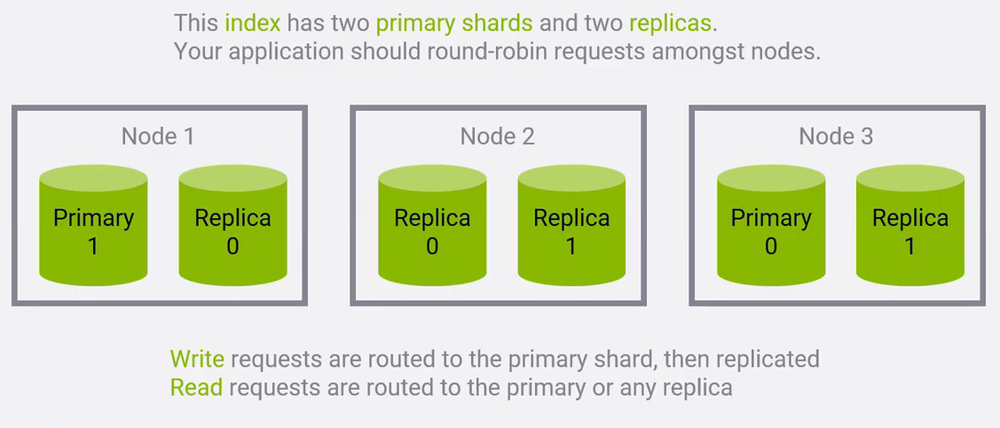

# Elasticsearch

### History

- Scalable Lucene FOSS search framework

  - A "shard' is an inverted index of documents running on an individual Lucene instance
  - Can handle structured data and can aggregate data (logs) quickly

- JSON (req and res) [see nodejs]

- NoSQL database

  - [NoSQL](https://en.wikipedia.org/wiki/NoSQL) meaning non-relational
  

## The Elastic-Stack

### Kibana

- The Web UI that sits on top of Elasticsearch (ES)
- Used as a visualizer for the data

### Logstash/Beats Framework

- Ways to feed data into ES
- Think of these as endpoints that feed data to ES to parse (like Splunk's Forwarders to the Indexers)
- Can monitor log files, parse them, and then import in near-real-time

### X-Pack (Paid)

- Security/Alerting/Monitoring/Reporting
- Also ML and Graph Exploration

## Logical Concepts

1. Documents - any structured JSON data
   - Every document has a unique ID and a data type -- can be static or dynamically given
   - Splunk's equivalent to an event
2. Types - defines the schema and mapping
   - In ES v.6, a single type per Index

3. Index - collection of types
   - Splunk's equivalent to a sourcetype

 

Big Picture: An index is a database, a type is a table, and a document is a row.

### What is an Inverted Index

Doc1:: Space: The final frontier. These are the voyages...

Doc2:: He's bad, he's number one. He's a Space Cowboy with the laser gun!

Inverted Index: space: 1,2; the: 1,2; final: 1; frontier; 1 .... etc

- How the ordering of a results queried is done = TF-IDF (Term Frequency *(times) Inverse Document Frequency)
  - Term Frequency = how often a term appears in a given document
  - Document Frequency = how often a term appears in all documents
  - TF / DF = measures the **relevance** of a term in a document

### Using Indices

- [RESTful](https://restfulapi.net/) API (GET, PUT, POST, DELETE)
- Client APIs - Elasticsearch libraries
  - `pip install elasticsearch`
- Analytic Tools (Kabana)

## How ES Scales

- Recall, each shard (or index) in a self contained instance of Lucene
- Documents are hashed to a particular shard
- Two shards can be on two completely different machines (nodes) within a cluster
- Primary and Replica Shards (done automatically)
  - Write requests would be directed to the Primary shards before being backed up in the replica shards
  - "Fault tolerant systems"
- **Plan Ahead**: cannot change the number of primary shards. Worst case you *re-index*

## Sources

- [HackQuarantine](https://hackquarantine.com/) - [Presentation w/ Install Instructions](https://amboulouma.github.io/elasticssearch-workshop/)
- [Frank Kane](https://www.youtube.com/watch?v=C3tlMqaNSaI) -- Good intro but on Udemy. Paywalls suck.
- [Why use Elasticsearch](https://www.youtube.com/watch?v=yZJfsUOHJjg)
