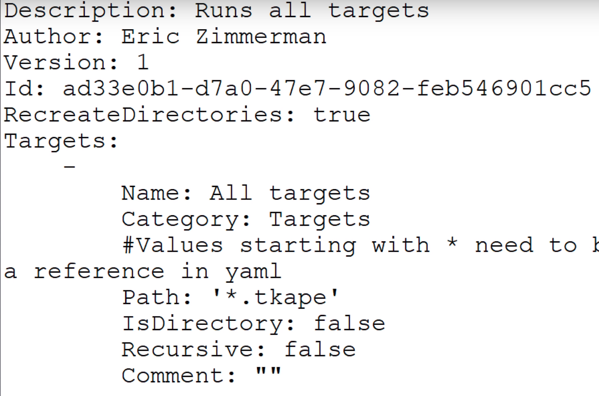
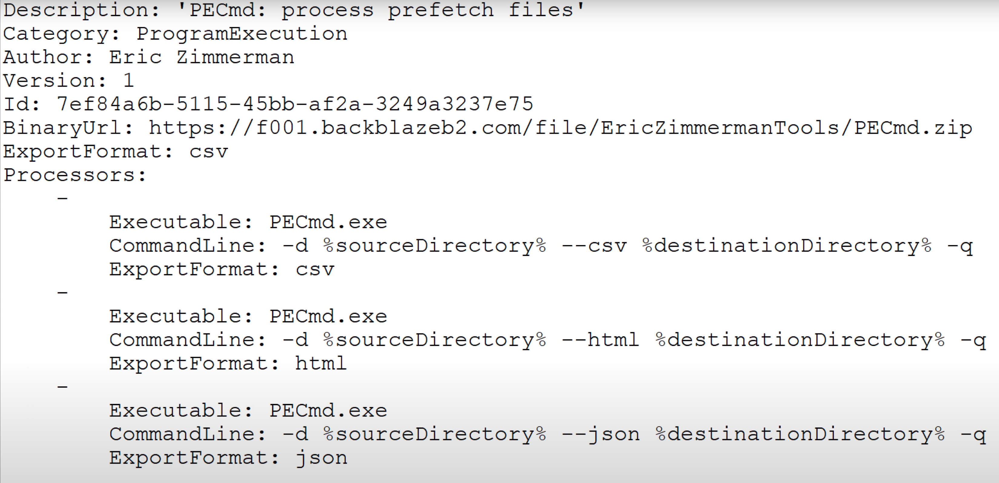
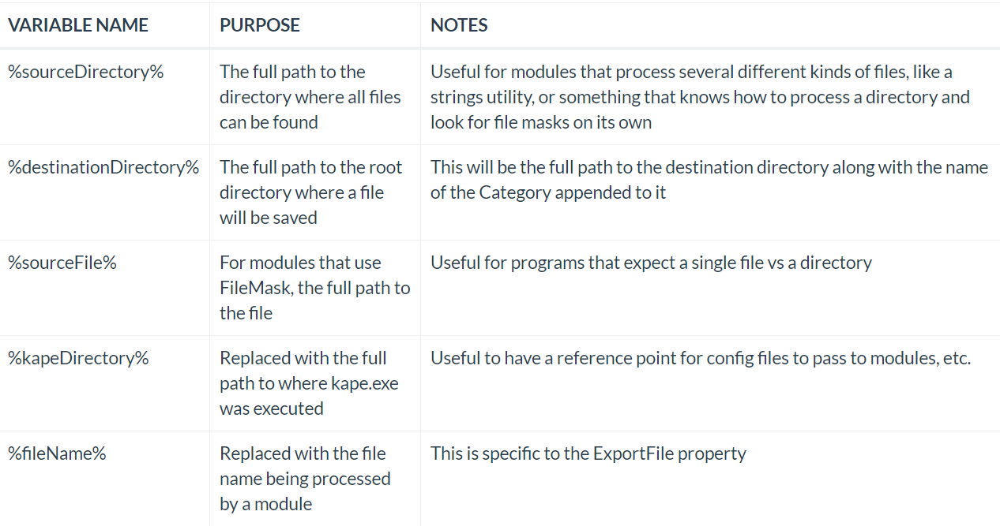

# KAPE

- [Main Site (Article)](https://kroll.com/en/insights/publications/cyber/kroll-artifact-parser-extractor-kape)
- [Download](https://kroll.com/en/services/cyber-risk/investigate-and-respond/kroll-artifact-parser-extractor-kape)
- [Features](#Fun-Features)
- [Things for Later](#Things for Later)

When mounting images for use with KAPE use Arsenal Image Mounter (AIM). Do NOT use FTK Imager or Dokan.

## Intro

- Created by Eric Zimmerman
- **1)** Collects files (aka **Target Collection**) and **2)** processes collected files (aka **Module Execution**) [with modular input from community](https://github.com/EricZimmerman/KapeFiles)
  - Can [sync with Github](https://ericzimmerman.github.io/KapeDocs/#!Pages\2.-Getting-started.md#Automatic_syncing_with_GitHub_repo) community
- Uses [targets](#1.-Targets) (`--tsouce`,`--tdest`) and [modules](#2.-Modules) (`--target`)
  - Written in YAML
- Does this in 15 minutes or less. [Src](https://kroll.com/en/services/cyber-risk/investigate-and-respond/kroll-artifact-parser-extractor-kape)

### How it works

- Adds file masks (per module) to a queue.
- **1)** Finds and copies files from a source location
  - Will then build a list of files
  - If a file is locked/protected/in-use, KAPE will come back to it on a second run. These are added to a secondary queue.
- **2)** The output from the programs is then saved in directories named after a category (ex: *EvidenceOfExecution (includes prefetch, shimcache, userassist, etc)*, *BrowserHistory*)

- During the secondary queue execution, KAPE uses raw disk reads to bypass the locks (enter memory forensics).
- Metadata is collected into log files as well
- Any target or module in the `!Disabled` directory will not be available in (G)Kape

### 1. Targets

- Collections of file and directory specifications 
- After the list of files is built, targets are run 
- Targets have a `.tkape` extension
- [Doc src](https://ericzimmerman.github.io/KapeDocs/#!Pages\2.1-Targets.md)
- [See more below](#Targets-In-Depth)

### 2. Modules (think Vol.py capabilities)

- Can target anything, including files collected via target capabilities (since targets run first)
- Can even run the output of live executables; *Ex: Dump netstat.exe to file*
- Modules have a `.mkape` extension
- [See more below](#Modules-In-Depth)

 

 

## Targets In-Depth

- Create new ones with the facts that they should  target specific artifacts that can be grouped together 
- *Category* field is super important
- *FileMask* field will match extensions **only**
- Can also compound Targets by just setting their `Path` field to another, more "fine-grained" target
- [Docs Src](https://ericzimmerman.github.io/KapeDocs/#!Pages\2.1-Targets.md)

## Modules In-Depth

- A module’s job is to run programs against files, often generating output in the form of CSV or text that can then be reviewed by an examiner.

- **NOTE: Modules can only run ONE command; as such, you need a module for every executable you want to run against collected data.**

- *FileMask* field here is useful for targeting specific files; like $MFT.

- Must include *Processor* field; at least one but can have more

  - If more it is for a slight variation of the cmd; e.g. export formats, recurse 3 or 4 times, etc.

  - Can either be an executable or CommandLine

  - **Executable**

    - Required. The path to the executable is NOT necessary and only the name of the executable (with extension)
    - Chosen executable should be placed in `[KAPE directory]\Modules\bin`
    - Symbolic links can be done but have to use the `/h` switch

  - **CommandLine**

    - Required. Do **NOT** try to use redirection.

    

  - **ExportFormat**

    - Required. Ex: `ExportFormat: csv`

  - **ExportFile**

    - Optional. Ex: `ExportFile: devices.txt`

  - **Append**

    - Optional. For example, this is useful for processing several ntuser.dat hives and getting all the output in a single file, vs one file per ntuser.dat hive.

- [Docs Src](https://ericzimmerman.github.io/KapeDocs/#!Pages\2.2-Modules.md#Processors)

## Fun Features

-  Metrics related to KAPE activity is displayed in the Title bar of the console window.
- Long file names supported. However, when using containers they can only handle 255 chars
- Update KAPE's targets and modules with: `kape --sync`
- Update KAPE itself with `Get-KAPEUpdate.ps1` script
- Can automate with [Batch Mode](https://ericzimmerman.github.io/KapeDocs/#!Pages\3.1-Batch-mode.md)
- Can be done over [SFTP](https://ericzimmerman.github.io/KapeDocs/#!Pages\6.-SFTP.md) 
- Can change "All at once" processing to Linear via the `--ul` switch.
- [Other Tips & Tricks](https://ericzimmerman.github.io/KapeDocs/#!Pages\60-Tips-and-tricks.md)
  - Use environment variables in KAPE: `"--mdest c:\temp\out%COMPUTERNAME%"`
  - KAPE should best be run as system.
- KAPE [supports proxy](https://github.com/EricZimmerman/KapeFiles/issues/121#issuecomment-524682298)

## Sources

- [13Cubed](https://www.youtube.com/watch?v=pZRrZAJif8Q)
- [Docs](https://ericzimmerman.github.io/KapeDocs/#!index.md)
- [SANS YouTube](https://www.youtube.com/watch?v=iYyWZSNBNcw&feature=youtu.be)
- [Forensics Lunch YouTube](https://www.youtube.com/watch?v=Lwu1Deb6-xg)

## Things for Later

- [VSS - Volume Shadow Copies](https://www.andreafortuna.org/2017/10/02/volume-shadow-copies-in-forensic-analysis/)
