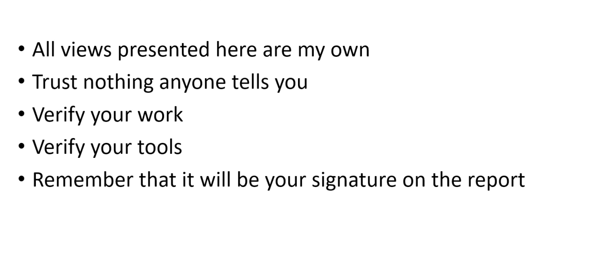
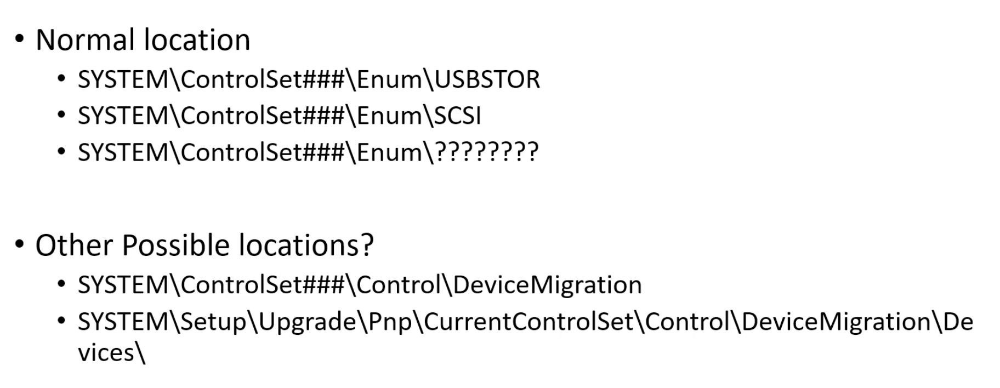
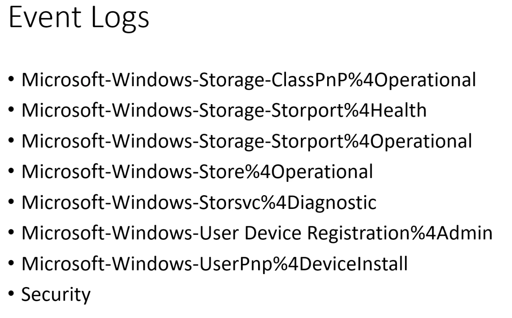
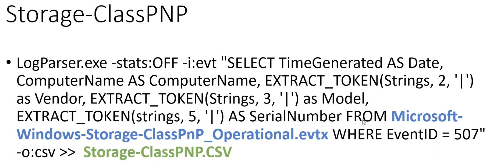
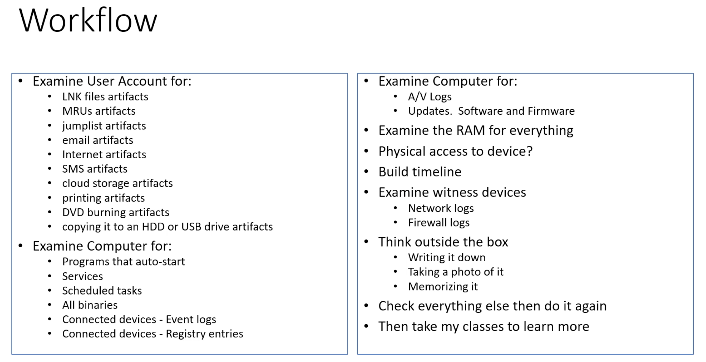

# Magnet Forensics: Creating a Digital Forensic Workflow to Combat Data Exfiltration 5/28/20

- [USB content - Case 3](#Case-3)
- [Final Workflow](#Final-Workflow)
- [Check Out Later](#Check-Out-Later)

## Case 1

- Using iphone to post nudes at work
- Win10 Domain, not encrypted laptop
- [Cipher](https://cipher.com/rts-red-team-services/) - EFSTMPWP -- will wipe free space without admin privileges
- Evtxid 4688 (new proc started) that printed docs from outlook
- There existed anti-forensics: 
  - no LNK files
  - no MRUs
  - no jumplists
  - no email artifacts
  - no internet artifacts
  - BUT evtx logs show the docs had been printed

## Case 2

- Document had been released, could not identify any one user
- from the emails we hada. starting point (had a username)
- Examined computers for malware:
  - autoruns
  - services
  - scheduled tasks
  - RAM - procs via vol.py
- No malware found but we know the documents were printed, so go to the printer -- runs win2000 that wasn't patched, with no firewall or av
  - Found one unauthorized program as a service

### Workflow

- examine autostart, services, scheldued tasks, all the binaries (quick signature check), AV, any updates, examine RAM, network/FW logs, physical access (root) to repairs

## Case 3

- Docs had been released but don't know where so need to check 60 computers for malware. Many users had reasonable cause to check these documents though

- Reg key: `SOFTWARE\Microsoft\Windows NT\CurrentVersion\EMDMgmt` is part of boot kit readyboost to make windows boot faster; just logs VSNs

- Looking at jumplists, MRUs, LNKs pointed to different volumes!

  - System\ControlSet##\Enum\SCSI were different

  

- Volume Serial numbers are located in EMDMgmt registry

- Make, model, SN of hard drives are located in SCSI registry

- Turns out there was an extra sata port

- Lesson: check if computer can have (internal) multiple harddrives

  - Also computers that have e-sata ports on external of computer
  - This is because, even if bit-locked, RW capability!
  - NVMe's are super small!

- Just because it has a USB plug does not mean it will be stored in USBStor, could also be in SCSI.

  - "USB enclosures which contain SSDs might stored in SCSI not in USBStor"

- Normal location:`System\controlset##\Enum`

  - Backup: `SYSTEM\control###\Control\DeviceMigration`
  - `System\Setup\Upgrade\Pnp\CurrentControlSet\Control\DeviceMigration\Devices\{SCSI, USBStor}`

- Problems with Group Policies

  - Write blocking of USB devices 
  - Policies usually don't work/aren't tested
  - `Enum\PCIStor\` windows10 is an SD Card reader built into machine
    - Since PCI, RW is given circumventing policies!

### Other locations

- Note: Registry keys change with every update

### Evtx Logs that store info about storage devices

- Can use [Microsoft Log Parser 2.2](https://www.microsoft.com/en-us/download/details.aspx?id=24659)
  - Ex: 

### Workflow

- examine for malware/unauth progs
- connected devices
- Timeline for when devices were connected and correlate to physical
- Whats going on? At off hours, user was connecting other people's hard drives to his workstations
  - Other artifacts - power off/on times

## Case 4

- Documents had been released, on closed networked
- Locked down Win10 computer with documents allowed to be in users possession
- no usb, cd, access. No malware, printing, internet access
- So how did the data get out?

- Theif had photographic memory
- Had to obtain search warrant for personal cocmputer

### Workflow

- Emaine malware/unauth progrs
- examine connected devices
- Think outside the box

## Case 5

- Multple peeople reported identify theft. All went to same medical clinic at the same time
- Network logs showed only one medical tech
- Checked emplotee's performance reviews that got in trouble
- Win10 work computer to access Unix type program via terminal window. Very closed network with smart card log on (not admin). Locked down computer, even print screen was disabled.
- So how did the data get out?
  - he took pictures with his phone and then uploaded to google drive.

### Workflow

- Exame for malware/unauth prog
- Examine connected devices
- Timeline, who was on the keyboard at the time

## Case 6

- Docs had been released
- All ports locked down on physical machine. However they missed the CD/DVD burner.
  - so no group policy banning cd burning

### Workflow

- Email/SMS
- Cloud Storage
- Printing
- Burning ti to DVD
- COpying to external driver
- writing it down
- taking a photo
- Memorizing it

## Case 7 - Domain admin

- Evt1: would terminate email accounts for no reason
- Evt2: caught logging into domain user's computers after hours.
- Evt3: Internal IDS was deployed without his knowledge and was caught again logging into domain user's computer after hours

#### Post investigation

- Turns out, he was reading documents pertaining to himself
- Then downloaded his PII and "personal" photos of employees
- And configured outlook to read the boss's email
- Would also surf porn to bypass firewall
- All files made it to his home computer via email

### Workflow

- document metadata to determine owner
- jumplists, mRUs, LNK files all showed accessing files he should not have
- PST on desktop belonging to someone else
- Internet history
- Evt logs showing which account logged on to which computer
- FW logs showing access
- Other creative logs - temperature
  - Is the firewall actually turned on or configured?

## Final Workflow

- Check "gold builds" to see what should be there and what shouldn't

## Tools for Examinations

- Magnet Axiom, Linux (vol.py), vm's, cli tools (log parsers), google

## Check Out Later

- Cortana cache