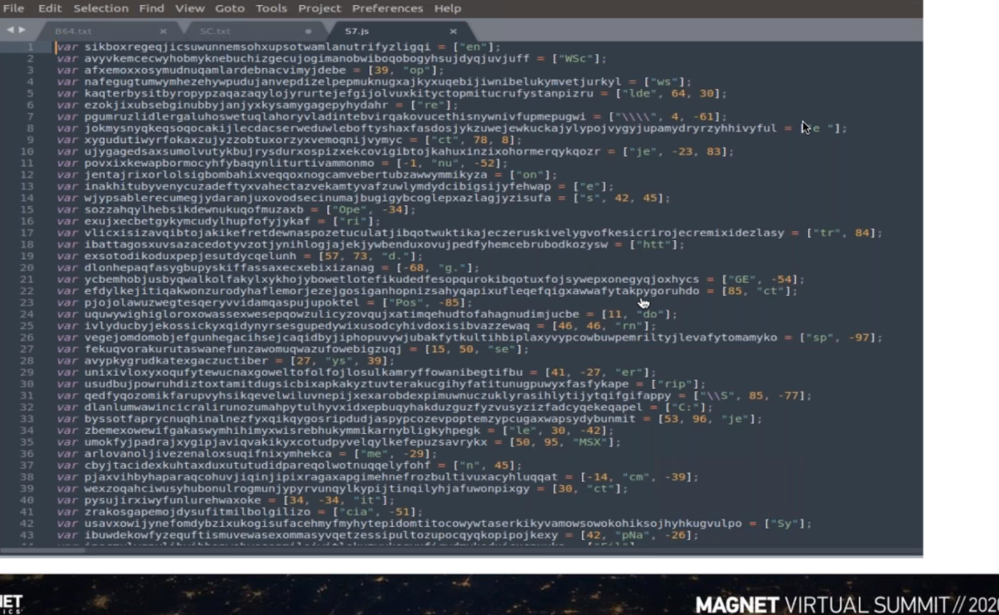

# Magnet Forensics: Emoting Over Emotet and Maldoc  5/22/20

- [What to look for in malicious documents](#Documents-Summary)
- [Check Out Later](#Check-Out-Later)

## Summary

- [Emotet](#Emotet)

- [Different Doc Types](#Document-Types)

- [Analysis Tools and Walkthough](#Analysis-Walkthrough)

  

## Emotet

- Since 2014, it's a Malware as a service banking trojan
- Targets numerous industries: finance, govt, energy, shipping, utilities, etc
- Distributes malware such as Trickbot and Zeus Panda
- Its a dropper, credential stealer (from web browsers and email clients). Leverages legitimate software
- Obfuscation techniques via polymorphic packers and encrypted imports
- Leverages document as a delivery mechanism

### Functionality

- utilizes process injection: explorer.exe
- establishes persistence
- Comm via C2

## Document Types

### PDFs

- = Portable document format
- Can contain action scripts (embedded flash)
- File structure
  - Header - contains version info
  - 1 or more objects that render the document (text, fonts, js)
    - Use indirect object to refer or point to other objects that may have a unique id
    - 1st is object number, then generation number
    - `AA` (Automatic Action) is leveraged by malware
    - Objects use streams to store data AND js
  - xref table
  - trailer

#### Tools

- [pdfid](https://blog.didierstevens.com/programs/pdf-tools/)
- [pdfparser](https://github.com/smalot/pdfparser)
- [pdfinfo](https://www.xpdfreader.com/pdfinfo-man.html)
- peepdf - python framework. Helps deobfuscate js via spidermonkey.

### Office Documents

- =Macros, written in VBA, are legitimate so not always blocked

- They run automatically, like *AA* in PDFs

- Look for VBA=`execute` and JS=`eval`

  

Has two formats

- OLE2 - similar to file system with storages (folders) and streams (files)
- something else

#### Tools

- [oletools](https://github.com/decalage2/oletools) [includes oleid, oleobj, rtfobj, …](http://www.decalage.info/python/oletools)
- oledump
- [vmonkey (Vipermonkey)](https://github.com/decalage2/ViperMonkey/blob/master/vipermonkey/vmonkey.py) - powerful framework

### RTF

- =Rich Text Formats are supported by MS and Non-MS applications

- Doesn't support macros
- When ms word opens a RTF doc it will extract the embedded object to the users temp directory
- `\objdata` control word will point to an embedded object

#### Tools

- Rtfdump

- rtfobj

  

### Documents Summary

- In PDFs: Automated Actions
- In Office Documents: VBA=`execute` and JS=`eval`
- In RTF: `\objdata`

## Analysis Walkthrough

#### OLE Files MS Docs

1. oleid – look for marcos=True
2. exiftool or olemeta
3. [vmonkey](https://github.com/decalage2/ViperMonkey/blob/master/vipermonkey/vmonkey.py)
4. [oledump.py by Didier Stevens](https://blog.didierstevens.com/programs/oledump-py/) to check interesting strings (will confirm what's seen in vmonkey)
   1. .rsrc is parts of PE header leads to believe embedded executable is inside this document.
   2. Finding mutex's is a sign (**not guarantee) of malicious intent
5. oledump.py file | [pecheck.py](https://github.com/DidierStevens/DidierStevensSuite/blob/master/pecheck.py)
   1. `4D5A` (MZ) is magic bytes of PE file
6. Now use oledump to carve
   1. oledump.py maldoc.doc -s 14 -C 0x00063:0x16862 -d > output.exe
7. `$pescan.py output.exe`
8. `$malwoverview -f output.exe -v 1 -p 1` **will check virus vendors**

#### Other tools to use

1. `$olevba maldoc.doc –deobf –decode` ([docs](https://github.com/decalage2/oletools/wiki/olevba))
2. OfficeMalScan [Win.exe] can automatically carve 

3. [peframe](https://github.com/guelfoweb/peframe)

#### Shellcode Doc

1. [mraptor](https://github.com/decalage2/oletools/wiki/mraptor) my.doc -m -r – will tell you if macros exist and if they are suspicious
2. olemeta or exiftools
3. olevba my.doc –decode -deobf 
4. vmonkey my.doc
5. sc_distorm SC.bin
6. [scdbg](http://sandsprite.com/blogs/index.php?uid=7&pid=152) -f shellcode.bin – will step through shellcode

### PDF

1. pdfinfo invoice.pdf – check version and then google common exploits for that version
2. [pdf-parser.py](https://github.com/DidierStevens/DidierStevensSuite/blob/master/pdf-parser.py) invoice.pdf -o 7 | base64dump.py -s 2 -t utf8 -a # parse the deobfuscated base64
3. ppdf invoice.pdf -i -c – includes spidermonkey to analyze js. Will also say whether or not file is found in virustotal
   1. decode file raw_7.txt b64
   2. decode file raw_7.js b64
   3. quit
4. We've parsed out the malicious code, now figure it out.

### PDF2

1. pdf-parser.py payroll.pdf -a # see references to js and openaction

2. pdf-parser.py payroll.pdf -o 5 # see object 5

3. pdf-parser.py payroll.pdf -o 5 -c -w # see object 5 and output prettyprinted

4. [sc_distorm](https://github.com/mgoffin/malwarecookbook/blob/master/6/9/sc_distorm.py) o 9.sc

5. scdbg -f shellcode.bin -fopen payrtoll.pdf -u -i # emulation

6. peframe shellcode.drop

7. peid - checks which packer we're using

8. pe check shellcode.drop

### RTF

1. [rtfobj](https://github.com/decalage2/oletools/wiki/rtfobj) some.doc
2. rtfscan some.doc scan
3. [rtfdump](https://github.com/DidierStevens/DidierStevensSuite/blob/master/rtfdump.py) some.doc #we see the objdata reference
4. rtfdump.py some.doc -s 5 # check object 5
5. rtfdump.py some.doc -s 29 -H -c 0x97B:0xA22 -d > b64.txt
6. python [loffice.py](https://github.com/tehsyntx/loffice) word none some.doc #lazy office attaches to windows debugger

## Check Out Later

- [Malwareoverview github tool!](https://github.com/alexandreborges/malwoverview)

- [This guy (Didierstevens - decalage2)](https://blog.didierstevens.com/) with his suite https://github.com/DidierStevens/DidierStevensSuite

- [sc_distorm.py](https://github.com/mgoffin/malwarecookbook/blob/master/6/9/sc_distorm.py)

- [lazy office analyzer](https://github.com/tehsyntx/loffice) in combination with fakenet-ng then save the vmem and use vol.py netscan and then filescan | grep -i .vbs

- [Emotet bromium link](https://bromium.com/wp-content/uploads/2019/07/Bromium-Emotet-Technical-Analysis-Report.pdf)

- [Emotet USCert link](https://us-cert.gov/ncas/alerts/TA18-201A)

  

